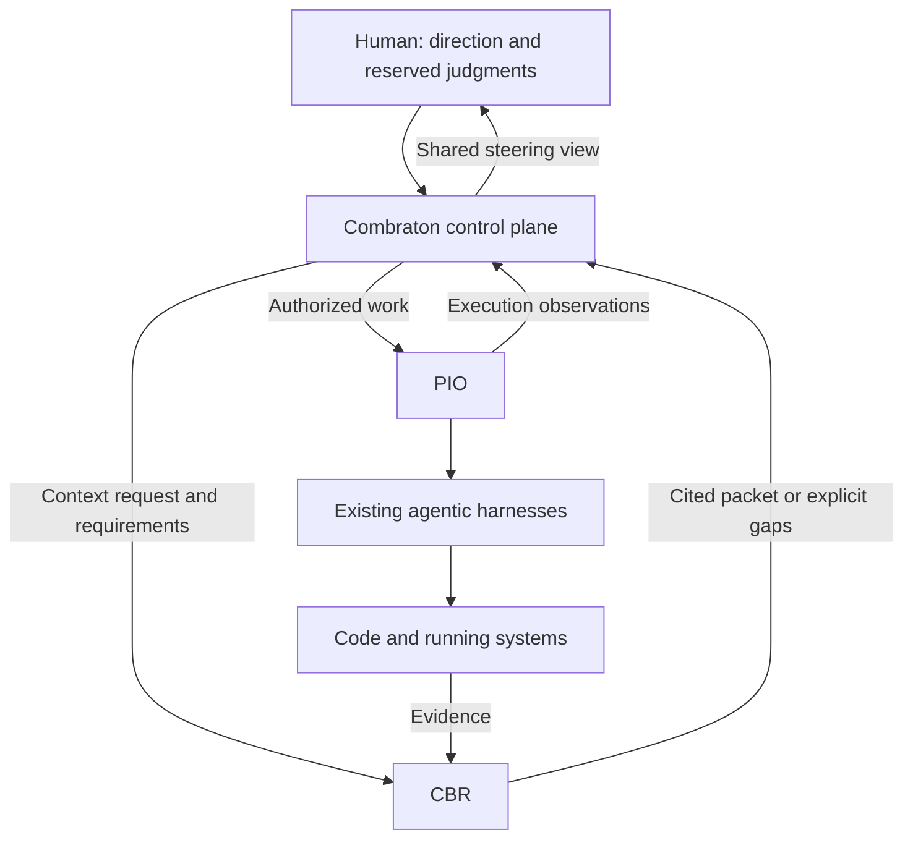

# Combraton

A spatial control plane for building large greenfield and brownfield projects with existing agentic harnesses.

> Bootstrap documentation only. No product runtime, released API, installation command or performance claim is established here. The reviewed architecture is `architecture-v1-20260912`, published as `public-development-v1-20260913`. Canonical specifications are available through [the documentation map](docs/README.md). This README is an overview, not the full specification.

Combraton keeps the human, agents and running code connected through explicit intent, workflows, evidence, history and steering. Its success is better accepted work and less reconstruction effort than disciplined use of the same harnesses individually, accounting for time, cost and attention.

## System boundaries

| Repository | Responsibility |
|---|---|
| [combraton](https://github.com/Combraton/combraton) | Human-steered control plane and desktop application |
| [pio](https://github.com/Combraton/pio) | Independent native-harness execution and recovery |
| [cbr](https://github.com/Combraton/cbr) | Independent evidence-backed memory and context |
| [protocol](https://github.com/Combraton/protocol) | Independent semantic contracts and conformance fixtures |

Combraton owns selected project direction, workflow readiness, project acceptance and branch adoption. PIO owns execution facts; CBR owns evidence and derived context. They communicate through public protocol profiles, not shared writable tables. Both PIO and CBR are useful without this control plane and can serve other applications.

## Product invariants

- Routine investigation and repair continue within agreed scope. Intervene for a needed change of direction, authority or reserved judgment. Block specific consequential transitions whose conditions are unmet.
- Workflow executable nodes are existing harnesses. Their native investigation/edit/test loops remain intact.
- Templates are optional reusable methodology/configuration; instantiation creates concrete workflow revisions. Stages group workflows and add no canvas level. Standard and user templates use the same operations.
- Semantic zoom navigates orchestra, project, session and workflow canvases. Alternate views operate on the same semantic model.
- History retains immutable revisions and alternative branches. Restart creates a successor and explicit reuse; it does not undo external effects.
- A result receipt is not project acceptance. A displayed restriction is not proof of OS enforcement.

## Development sequence

Establish a small versioned protocol and failure fixtures first. Develop PIO and CBR foundations in parallel against those contracts. Prototype and assess spatial interaction alongside them. Integrate an early, narrow control-plane flow before either subsystem is feature-complete; expand only after its required evidence passes.

The first integrated scenario is a scoped code change with a failed attempt, preserved evidence/context, controller restart and fresh-harness continuation. See [BOOTSTRAP.md](BOOTSTRAP.md) for the work model, unresolved stack selections and deferred dogfooding.

## Loom UI

The existing design prototype is named **Comreton — Loom**. Its source/runtime integration, accessibility, performance and actual service bindings still need assessment before production adoption. Its local preview is not a deployable service or proof that backend state is real. Preserve its semantic zoom and history work instead of starting another generic dashboard.

Older architecture material uses **Comreton**. **Combraton** is the confirmed GitHub namespace. Record any final product/package naming cleanup before publishing packages; it does not change service ownership.

## Implementation status

Architecture boundaries are settled. Concrete schemas, package versions, qualified models, renderer and enforcement backends require bounded implementation experiments. Do not infer a chosen Pi/Prime SDK or numerical budget from research examples. No license has been selected in this bootstrap; the repository is public.

## Working on this repository

Read [AGENTS.md](AGENTS.md), [CLAUDE.md](CLAUDE.md), [the documentation map](docs/README.md), and [verification](docs/VERIFICATION.md). Use existing native harnesses for development. **Combraton self-development is deferred until usable v0.1 releases of all four projects.** Public visibility does not select a license; no project license has been added yet.
