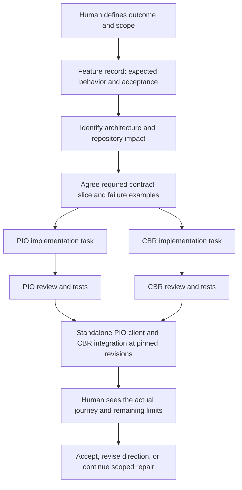

# How we build Combraton

Development agreement `development-v2-20260913`, superseding the earlier integration order under [ADR 001](decisions/001-standalone-first-and-evaluation.md). This is the single canonical development workflow for the four product repositories and their benchmark infrastructure. It applies to building the products with existing Claude Code, Codex and ordinary development tools. **Combraton self-development is deferred until roughly v0.1 of all four projects has shipped and passed its relevant acceptance checks.**

We optimize for accepted work, continuity and understandable decisions. More agents, more tokens and more completed tasks are not success by themselves. The [research assessment](research/DEVELOPMENT-WORKFLOW-AND-ECC.md) explains evidence, alternatives and limitations; its earlier integration-order recommendation is superseded. [Standalone release gates](STANDALONE-RELEASES.md) define when Combraton implementation can begin.

## 1. Four products and separate evaluation infrastructure

| Repository | Owns | Must not become |
|---|---|---|
| [Combraton](https://github.com/Combraton/combraton) | Human direction, workflow readiness, acceptance, history adoption, desktop and cross-system integration | A second execution journal or memory database |
| [PIO](https://github.com/Combraton/pio) | Standalone harness execution, process/workspace identities, receipts and recovery | The authority deciding project direction or whether a claim is true |
| [CBR](https://github.com/Combraton/cbr) | Standalone evidence, memory revisions, bounded model jobs and exact context packets | An agent that silently approves its own conclusions as project policy |
| [Protocol](https://github.com/Combraton/protocol) | Independent versioned contracts, compatibility rules and conformance fixtures | A scheduler, a shared writable database or a Combraton-only API |

[Benchmarks](https://github.com/Combraton/benchmarks) owns reproducible cross-product scenarios, comparisons and result manifests. It is a fifth repository, not a fifth runtime service; Protocol still owns normative conformance fixtures. Product-local tests stay with their services.

PIO and CBR must pass standalone acceptance without a running Combraton. A documented public integration is allowed; a private sibling import or shared database write is not. The organizational repository layout does not require four different programming languages or four separate teams.

The development guide is central for discoverability. That gives Combraton no extra runtime authority over standalone PIO or CBR users. Their local maintainers and callers can use their own process and grants.

## 2. Who is responsible

The human selects the outcome, approves material changes of direction and decides explicitly reserved judgments. A **feature coordinator** maintains one cross-repository feature record. This can be a normal agent session; it is a temporary role, not new software or a permanent “brain.” If that session ends, the record lets another session take over.

Each bounded implementation task has **one accountable owner** and one assigned branch/worktree. The owner may use helpers but remains responsible for the result. A reviewer independently examines the actual changes and evidence. One person may be the maintainer for all four projects initially; do not invent four human approvals to simulate an organization we do not have.

Claude and Codex are interchangeable candidates for these roles. A useful first arrangement is Claude implementing CBR while Codex implements PIO, followed by reciprocal review. The reverse is equally reasonable. Keep an assignment for a slice when continuity helps; do not turn a temporary assignment into permanent model-based repository ownership.

Record the actual harness/model/version when comparing outcomes. Choose future assignments using defect discovery, accepted outcomes, cost and handoff quality, not claims that one brand inherently owns architecture and another owns implementation.

## 3. Minimum coordination infrastructure

Use what GitHub already provides:

- **Feature issue:** overall outcome, affected repositories, linked tasks and integration acceptance. Use the leading product repository: PIO for its standalone client/CBR feature, Protocol for a contract change, Benchmarks for a comparative evaluation, and Combraton for later control-plane features. Link dependent issues; do not create duplicate feature records.
- **Component issue:** one owner, bounded scope, dependencies and measurable checks. A small user-authorized fix does not need an issue before investigation begins.
- **Pull request:** concrete diff, actual validation, review and linked issues.
- **Versioned docs:** architecture, decisions, multi-session plans and handoffs. Save consequential knowledge here instead of relying on a particular chat.
- **Integration evidence:** the exact combination of repositories, protocol revision, environment and commands that was tested.

Issue status owns work progress. Git owns code and decisions. A handoff is a dated observation, not a competing live task board. A Project board can later project issue status; a second independently maintained spreadsheet or dashboard is unnecessary now.

For a large task, use [the task packet](templates/TASK.md). For a brief fix, put those essentials in the issue or PR rather than creating several empty documents. Keep near-term tasks detailed and later milestones coarse. We are not generating a hundred speculative issues before proving one journey.

## 4. Normal feature lifecycle

This example covers the standalone-first stage. Combraton tasks enter the same feature lifecycle only after the [standalone release gates](STANDALONE-RELEASES.md) are accepted.

**Frame.** Describe the user-visible outcome and its distinguishing test. “Show context” is too vague. “Show which exact context packet was bound to this attempt, and do not label a generated packet delivered when the adapter cannot confirm delivery” is testable.

**Inspect.** Read the relevant specs and current code. Identify protocol, persistence, authority, UI and deployment impacts. A local rendering change may need no protocol modification. Do not manufacture a cross-repository process for every task.

**Decide the boundary.** Agree examples, failure semantics and compatibility before separate implementations depend on them. Research unresolved components with bounded experiments. Record important choices in an ADR, with alternatives, evidence and the sections it supersedes.

**Implement.** Give each owner a task packet and isolated working state. Routine search, local edits, tests, experiments and repair continue inside the agreed scope. Failed local tests feed the repair loop. They do not require a human permission request to investigate.

**Review.** Review a recorded base and candidate head. The reviewer should read requirements and the diff before the implementer's explanation can dominate the review. Findings need a concrete failure case, file reference, consequence and evidence. “Looks good” and two models agreeing are not tests.

**Integrate.** Run the real journey using compatible pinned revisions. Independent green test suites do not prove the repositories work together. Record which dependencies were real, simulated or unavailable.

**Accept.** Present the outcome, divergence, checks and remaining judgments in a concise decision packet. The authorized maintainer merges according to the task's existing authority; the workflow does not grant agents publication, deployment or credential authority. Re-ask only when authority, direction or a reserved judgment actually changes.

## 5. Standalone-first development

Implement and publish the agreed standalone protocol surface with schemas, profile dependencies, failure semantics and conformance fixtures. Define its release scope before building; not every future Coordination or Remote extension is a prerequisite. Unimplemented profiles must remain explicitly unsupported.

Build PIO and CBR in parallel to their complete agreed independent release scopes. PIO provides a usable native CLI/TUI that discovers and manages supported harnesses. Its standalone client optionally obtains CBR context through public profiles under user-selected policy. Core execution remains usable without CBR; CBR direct-provider operation remains usable without PIO.

Use the PIO client and headless test clients to validate the three together as their implementations mature. Complete standalone acceptance and publish the corresponding releases before starting thin Combraton implementation. Then use Combraton integration experiments to identify justified upstream changes. The protocol remains versioned and revisable throughout; a release is not a claim that every future integration is already solved.

Existing Loom prototypes remain design references. They do not require production Combraton bindings before the standalone gates. [Standalone release gates](STANDALONE-RELEASES.md) and [PIO client semantics](https://github.com/Combraton/pio/blob/main/docs/spec/STANDALONE-CLIENT.md) define the details.

For a cross-repository contract change:

1. Assign one protocol-change owner and link affected consumer tasks.
2. Record the exact existing protocol version/commit and proposed semantic change. Include error cases, optional/required fields, unknown capabilities, idempotency and observation limitations where relevant.
3. Gather provider and consumer review. One author does not mean one-sided requirements.
4. Land compatible additive contracts and fixtures first. Consumers may adopt independently while the previous contract remains supported.
5. For a breaking change, agree an explicit migration or capability/version negotiation path. Never assume simultaneous atomic merges across four repositories.
6. Pin each consumer to the intended revision. Record the tested combination in [integration evidence](templates/INTEGRATION.md).
7. Remove transitional support only after its documented compatibility obligation ends.

A machine-readable schema alone does not define delivery, recovery or authority. Fixtures must distinguish meaningful outcomes. Before schemas exist, prose examples are design input, not a released API.

## 6. Parallel sessions and subagents

| Work | Default arrangement | Why |
|---|---|---|
| Small local fix | One session, self-check, proportionate review | Coordination would exceed the task |
| Independent PIO and CBR implementations | Two top-level sessions with separate repositories/worktrees | Each needs durable ownership and a separate lifecycle |
| Investigation of logs or a dependency | Bounded read-only subagent where supported | Keeps noisy exploration outside the main context |
| Sensitive recovery or authority change | Implementer plus fresh reviewer; focused adversarial helper if useful | Independent challenge of consequences |
| Two tasks changing the same contract | Serialize the shared change; parallelize agreed consumers | Worktrees cannot prevent semantic conflict |

Start with at most two implementation owners plus coordination/review as needed. This is a workload default, not a protocol limit. Increase concurrency only after reviews and integration keep up.

Each concurrent writer needs an isolated git worktree and declared scope. A worktree isolates files; it does not isolate databases, ports, credentials, background processes or external services. Use separate test state and resource identifiers. Confirm another task is not writing the same resources.

A subagent gets: objective, allowed files/actions, relevant invariants, input revisions, expected output, bounded budget and stop condition. Prefer read-only research/review. If it must write, allocate non-overlapping scope and isolated working state. The parent must collect and verify its result; dispatch is not completion. Do not recursively create agents without a concrete need.

Top-level sessions do not share chat memory or automatically coordinate merely because they use the same model. Publish the task assignment before starting a second writer. If ownership is uncertain, inspect the issue, branch and running work; avoid a duplicate dispatch.

Use native supported subagents when helpful. No ECC tmux swarm or experimental team feature is required for v0.1 development. If the installed client lacks a feature, use a normal separate session and the same handoff format.

## 7. Fresh-session recovery and context management

On start, identify the repository, assigned issue, owner, current branch and head. Check for uncommitted changes and running processes before changing anything. Read `AGENTS.md`, the documentation map, the task and only the relevant domain sections. Read applicable nested instructions before editing in their scope; do not assume every harness discovers all nested files identically.

Read the latest handoff as historical evidence. Confirm commits and files exist; compare its head with the current head. An old “next action: create issue” is not permission to recreate an issue that already exists. If a result or artifact is missing, say so and reconstruct or rerun the relevant check.

Keep a small working set: current goal, constraints, relevant code, current evidence and unresolved question. Search with bounded output. Save full logs separately and return the failure excerpt plus command, exit status and artifact location. A concise summary must retain source references and uncertainty. Do not repeatedly summarize summaries while throwing away the original evidence.

At a useful checkpoint or before ending a multi-session task, update [the handoff](templates/HANDOFF.md): commits, files, decisions, checks, unresolved facts, active processes and next action. Persist facts and decisions, not a transcript of every tool call. Never copy credentials or raw private transcripts into public issues.

The root instruction files are maps. Claude's `CLAUDE.md` imports the local `AGENTS.md`, then adds short Claude-specific guidance. No giant architecture import occurs at session start. Nested instruction files will be added only when a real module has distinct commands or invariants; the empty runtime repositories do not need speculative instruction trees.

## 8. Example: exact context for a real harness attempt

**Requested outcome:** after a local repair, the human can inspect what the harness knew and what happened, without guessing from chat.

The coordinator records the journey: a user chooses a task and scope; CBR prepares an exact cited packet; the PIO standalone client applies the user-selected context requirement and binds the packet; PIO starts the authorized harness and records observable delivery/execution facts; the TUI shows the outcome and CBR links the resulting evidence. No Combraton runtime is involved.

Protocol work defines how references, packet identity, invocation identity, capability limits and observations are represented. The exact field names are chosen in the protocol task, not invented by this guide.

PIO's owner implements binding and observable delivery with one real adapter. A lost acknowledgment must not result in a duplicate process. CBR's owner implements packet construction and a correction received while preparation is underway. A missing mandatory input must remain an explicit gap, not disappear into a summary.

The PIO client owner connects the TUI inspector to these real states. A mock saying “delivered” is replaced with the actual observation level. If an adapter can only show that bytes were submitted, the UI must not claim the model comprehended them.

Cross-review tries to break the assumptions: wrong packet revision, a stale source, unsupported capability, duplicate event, crash between journal and dispatch, and waiting preparation whose consumer holds the needed resource. Tests are chosen for affected contracts, not added as ritual for unrelated code.

The integration run records Protocol, PIO, CBR and benchmark/fixture revisions plus environment identity; Combraton is explicitly absent. The human sees the exact packet and execution receipt. If required context is unavailable, only the named start/adoption boundary remains blocked; independently authorized investigation can continue. The coordinator closes the feature only when the evidence satisfies the original acceptance, or records an explicit scope revision.

## 9. Example: Loom shows a passing component check but the journey uses v1

After the standalone releases, Loom's simulated worker-v2 migration is a valuable Combraton acceptance story. The desired runtime path is worker v2; component checks pass; the observed trace still says v1. The important question is where intent and reality diverge.

Combraton's UI must link selected direction, expected path, evidence, the challenged assumption and pending judgment. PIO reports execution facts. CBR preserves the investigation and cites its source. Routine diagnosis continues within scope. A change of architecture or production authority requires the corresponding decision; it is not inferred from an agent's confidence.

Treat Loom as an interaction reference. Its shared world contains simulated projects and evidence. Editable graph visuals do not prove durable graph execution, memory correctness or recovery. The renderer spike must test continuous semantic zoom, multiple workflows in a session, stage grouping without an extra navigation level, keyboard alternatives, reduced motion and a representative scene size.

Then test a real journey through the backend. A screenshot is UI evidence; a trace from a real adapter is execution evidence. Neither substitutes for the other.

## 10. Verification and review evidence

Each repository's `docs/VERIFICATION.md` lists executable checks that actually exist. Initially these are documentation checks only. The first runtime implementation must add reproducible setup/build/test commands with pinned dependency versions. Do not tell a new agent to run a nonexistent `npm test` or claim that a clean doc check proves recovery.

For product code, record the test command, environment, exit code, tested revision, fixture/input and significant result. Preserve the command's exit status when truncating output; piping a failing build to a successful `tail` can hide failure. Do not label a grep result “security passed.”

Sensitive boundaries need meaningful counterexamples: crash/restart and ambiguous outcomes for PIO; unsupported claims, correction, stale scope and budget exhaustion for CBR; positive/negative compatibility fixtures for Protocol; authority transitions and understandable real journeys for Combraton.

Review at a concrete base/head. If fixes change the reviewed head, inspect those changes and rerun affected checks. Keep review findings separate from final human acceptance. A model reviewer is fallible; another model is useful diversity, not proof of independence or correctness.

## 11. Decisions, research and escalation

Cross-system architectural decisions live in Combraton's `docs/decisions/`; wire decisions and compatibility live in Protocol; local internal choices live in the owning repository's `docs/decisions/`. Link the decision rather than copying it into four places. An accepted decision names its authority, date, alternatives, evidence and superseded sections.

Research before selecting or changing harness adapters, recovery semantics, trust/enforcement, storage migrations, protocol compatibility, context/model runtimes or the spatial renderer. Use primary documentation and pinned source. Finish with a bounded decision or experiment, not an endless literature review.

Ordinary implementation choices within an accepted scope can proceed. Escalate a required change in direction, authority, boundary semantics or reserved judgment with a concrete proposal and consequences. Do not ask the human to approve every search, refactor or test. Do not quietly relax a check because the current implementation fails it.

## 12. Build sequence and remaining selections

| Phase | Practical output | Completion evidence |
|---|---|---|
| Development setup | Public repos, canonical specs, instructions and benchmark methodology | Fresh sessions can find sources; documentation checks pass |
| Protocol release foundation | Agreed standalone surface, concrete schemas and compatibility/conformance suite | Independent callers/providers and positive/negative fixtures |
| PIO and CBR in parallel | Complete agreed standalone product scopes, including PIO CLI/TUI and intelligent CBR memory | Real adapter/service, recovery, retention and quality acceptance |
| Combined standalone validation | PIO client optionally uses CBR through public profiles; no Combraton | Pinned three-product combination, fault suite and comparative evidence |
| Standalone releases accepted | Usable documented Protocol, PIO and CBR releases | All [standalone gates](STANDALONE-RELEASES.md) satisfied against agreed scopes |
| Thin Combraton, then expansion | Direct API integration, followed by full control-plane scope | Real steering/history journey; versioned upstream feedback |
| Later dogfooding | Consider Combraton coordinating changes to itself | Separate decision after usable v0.1 of all four products |

Rust/Tokio, independent SQLite stores and React/TypeScript remain starting preferences from the architecture baseline. Exact schema/framing, supported OS enforcement, adapter versions, CBR provider library/models and numerical budgets still need selection evidence. Desktop shell/renderer selection moves to the later Combraton phase. Do not call these finalized dependencies.

A spike should answer one blocking question with a small reproducible artifact, candidate version, success/failure criteria and fallback. For example: “Can the proposed adapter reconcile a surviving process after its parent restarts?” has a finish line. “Research all agent harnesses” does not.

## 13. Anti-patterns

- Pasting the whole architecture into every task or root instruction file.
- Letting chat, an auto-generated memory or an ECC instinct silently override a selected decision.
- Two writers editing a shared contract independently, even in separate worktrees.
- Treating separate worktrees as isolation of ports, databases or external effects.
- Permanently assigning a model to a repository based on brand stereotypes.
- A reviewer judging only the author's summary or an obsolete commit.
- Treating component tests, a successful response or a polished mock as full journey proof.
- Assuming cross-repository `main` heads form a tested combination.
- Delegating tiny work or launching a swarm before the acceptance criterion is clear.
- Blocking routine local investigation with repetitive approvals.
- Silently changing scope, permissions or acceptance to make a run succeed.
- Installing broad hooks, global settings or memory systems before measuring their value.
- Building a new coordination product just to coordinate building v0.1.

Standalone evaluation distinguishes contract conformance, real-adapter interoperability/reliability, downstream memory/task outcomes and TUI usability. Follow the [benchmark methodology](https://github.com/Combraton/benchmarks/blob/main/docs/METHODOLOGY.md); a joint demo does not certify every profile or prove better outcomes.
