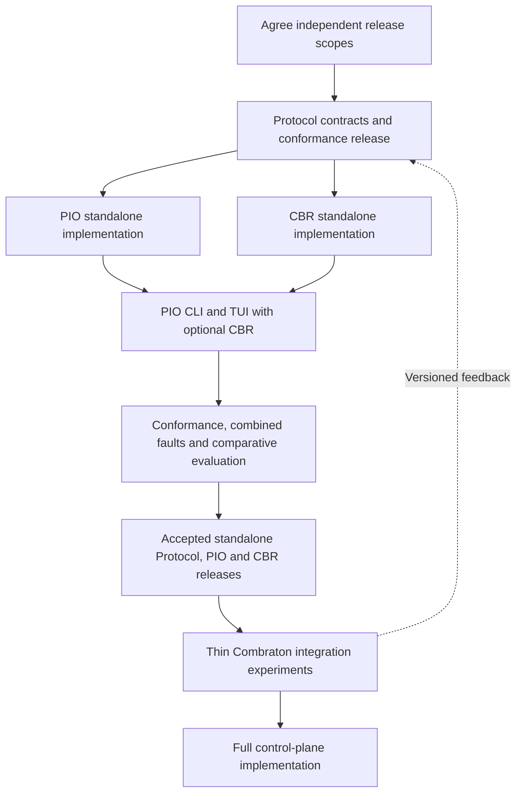

# Standalone release gates before Combraton implementation

Accepted sequence under [ADR 001](decisions/001-standalone-first-and-evaluation.md). The [development guide](DEVELOPMENT.md) remains the single operating workflow; this file defines product readiness, not a second task board.

## Build order

PIO and CBR can integrate progressively while completing their independent scopes; that does not bring Combraton implementation forward. Existing Loom exploration can remain a design reference. Production desktop/service binding and the Combraton runtime begin after the standalone gates.

## Define the scope before building

For each project, record supported operations/profiles, harnesses/models/OS targets, install/update/export behavior, failure semantics, quantitative acceptance criteria and explicit deferred extensions. Resolve blocking stack choices with versioned experiments. Agreement on architecture does not select every library, supported version or numerical limit.

“Full standalone release” includes the promised product capabilities, not only a subset needed by the future desktop. Infinite ecosystem support is not a release criterion. Any reduction of agreed scope must be an explicit decision. Version numbers describe released compatibility; they are not evidence of completeness.

## Protocol gate

- Publish concrete schemas, profile/dependency manifests, operation semantics, compatibility/migration policy and reproducible conformance commands for the agreed standalone release surface.
- Cover identity, grants, idempotency, bounded serialization, artifacts/evidence, packet/basis binding, observations, unsupported capabilities, failures and recovery where the declared profiles require them.
- Validate independent reference callers/providers and malformed/adversarial exchanges; two implementations sharing the same mistaken assumption are insufficient evidence.
- Keep unsupported future profiles explicitly unimplemented. Coordination/remote extensions are not silently counted as covered by a PIO–CBR test.
- Record the version consumed by PIO/CBR. Later corrections use explicit versioned changes and affected fixtures.

## PIO gate

- Installable standalone service plus CLI/TUI, documented public API and supported platform/adapter matrix; no CBR or Combraton process required for core use.
- Useful discovery/configuration, harness selection, concurrent execution, workspace ownership, native permission handling, output inspection, usage coverage, steering where supported, cancellation and recovery.
- Real adapter evidence for the agreed supported harnesses; the initial architecture proposes Codex and Claude Code as a pair with different native semantics. Other adapters have explicit scope/status.
- Durable identity/journaling/fencing and failure tests for lost acknowledgment, surviving process, stale writer, partial replay, ambiguous completion, budget liability and daemon/client restart.
- Complete supported persistence/upgrade, retention, export/restore and limitation documentation before calling the standalone release ready.
- Optional [CBR client integration](https://github.com/Combraton/pio/blob/main/docs/spec/STANDALONE-CLIENT.md) preserves user/caller policy and PIO core boundaries.

## CBR gate

- Installable standalone API/client path with direct evidence producers and model providers; no PIO or Combraton process required for core use.
- Immutable evidence, provenance, validated typed revisions, applicability, conflicting/historical claims, exact cited packets, scoped retention and export/restore for the agreed release scope.
- Model-assisted derivation, maintenance and request-time investigation are substantive capabilities. A vector/lexical store alone does not complete the agreed memory product.
- Bounded per-call and aggregate context/tool/model work, durable job progress, cancellation, restart and explicit gaps. Record supported model capacities and limitations; no mandatory million-token model.
- Adversarial correctness tests for false support, stale code/environment, changed authority, correction races, branch leakage, oversized results and missing required items.
- Real downstream task comparisons with a strong native-context baseline. Count cold initialization, maintenance, retrieval and investigation costs; publish uncertainty and unsuccessful cases. A packet fitting its token budget is not sufficient quality evidence.

## Combined standalone gate

Use PIO's CLI/TUI with optional CBR, plus a headless reference client, through public protocol profiles. No private database access, internal-function shortcuts or Combraton runtime are allowed in this gate.

Demonstrate a multi-session code task: discover/select supported harnesses; obtain cited context; run granted work; capture eligible evidence; make a correction; restart the client/services at controlled points; continue with a current packet. Include multiple harnesses and scope-isolated workspaces.

Prove no-CBR PIO and direct CBR still work. Cover CBR outage, advisory versus required context, delivery uncertainty, duplicate/lost messages, correction-before-dispatch and a CBR investigation needing PIO capacity. Do not introduce recursive automatic enrichment or reservation deadlocks.

Run [the evaluation methodology](https://github.com/Combraton/benchmarks/blob/main/docs/METHODOLOGY.md). Report separately: contract conformance, real-adapter interoperability/reliability, memory/task outcomes and TUI usability. Declare the tested versions and untested profiles. Agree quantitative product-quality thresholds before the confirmatory evaluation, based on pilot variance; do not move them after seeing results.

A successful combined demo is necessary evidence for composition, not completion of every standalone requirement. Both standalone gates and combined evidence must be accepted before Combraton implementation starts.

## Combraton gate and feedback

After these releases, build a thin Combraton caller with real task/context/execution/evidence/steering observations. It calls public service APIs and introduces its own control-plane state; it neither embeds PIO's TUI nor inherits the standalone client's authority implicitly.

Exercise actual runtime divergence, required checks, human judgment and restart before expanding the desktop. Change upstream services/protocol when evidence justifies it, preserving released compatibility or documenting migrations. Self-development remains deferred until Combraton also has a usable v0.1 and the separate dogfooding decision is made.

## Current status

All gates above are planned. Documentation validation is not a runtime, conformance, memory-quality or usability result. No test score, released API or completed product milestone is asserted here.
