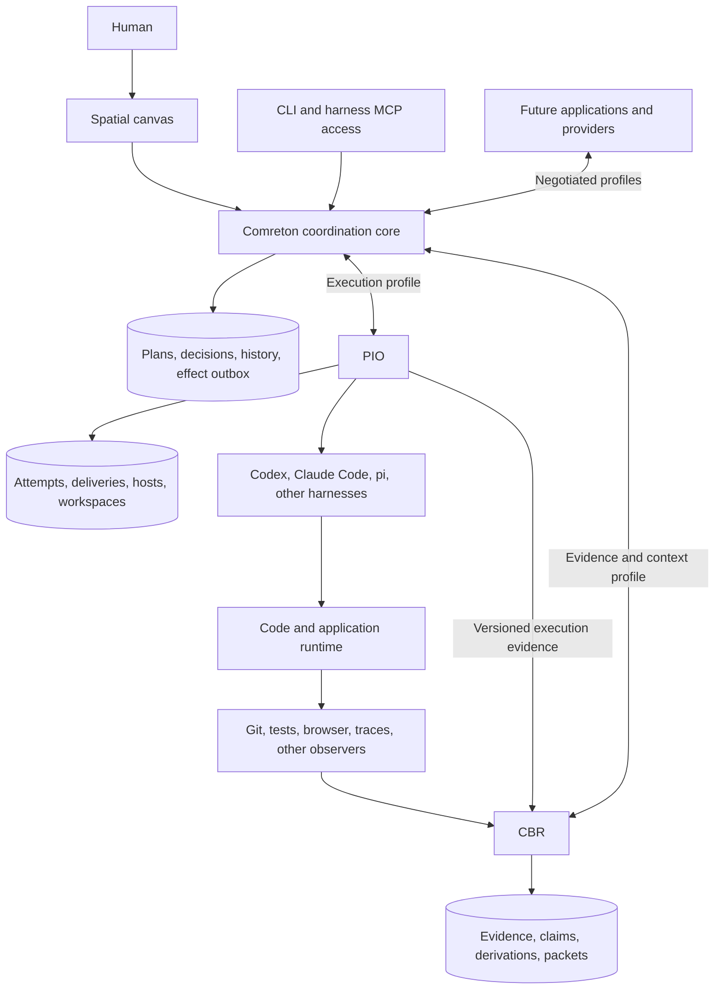
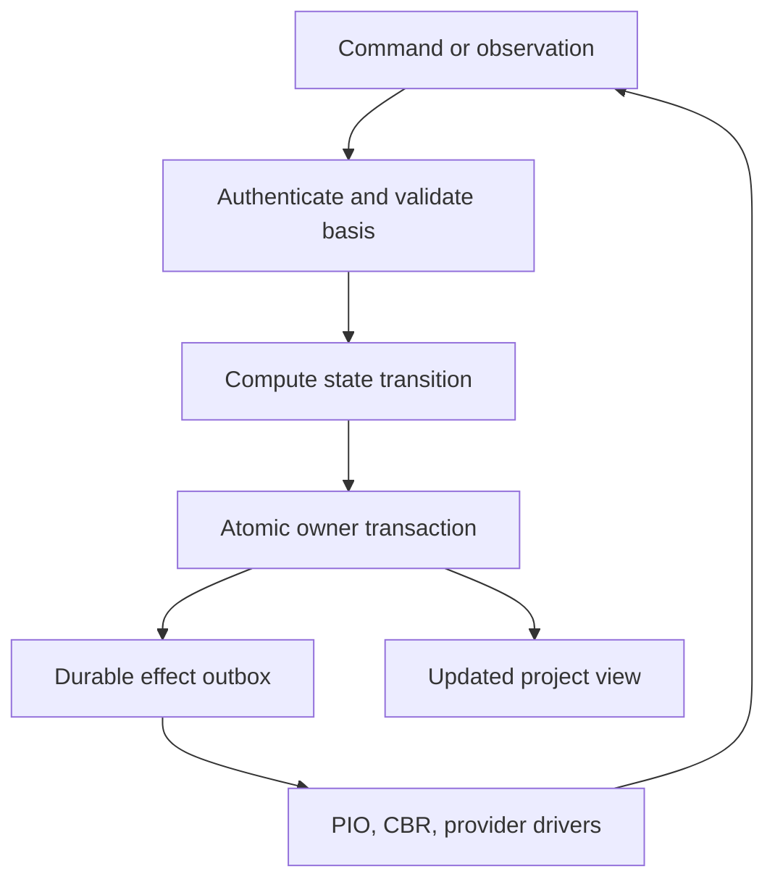

> Public edition `public-development-v1-20260913`. Adapted from the reviewed architecture baseline; names in the source may still say Comreton. See [publication and authority](PUBLICATION.md). Development sequencing is governed by [DEVELOPMENT](../DEVELOPMENT.md); self-development is deferred until all four usable v0.1 releases.

# Architecture: one controller, independent execution and evidence systems

> Accepted target architecture in [architecture-v1-20260912](BASELINE.md). Read [DECISIONS](DECISIONS.md) for selected behavior, reasons and remaining implementation selections.

## 1. The system at a glance

Comreton coordinates work and decides when an outcome may be relied on. PIO controls harness execution. CBR maintains evidence-backed memory through model-assisted investigation and artifact revision, then prepares task-specific context through a bounded request loop. All three have their own durable state and independently useful public APIs. They communicate through a small semantic protocol rather than shared tables.

The diagram's direct PIO-to-CBR route carries evidence and context traffic under a work binding authorized by the controller. It cannot bypass Comreton's plan, gate, or acceptance decisions.

CBR's model-assisted memory jobs are local service work under that scope, not additional project workflow nodes. It can call a configured model provider directly or delegate an existing-harness investigation through PIO. PIO is optional for standalone CBR. See [the memory engine](https://github.com/Combraton/cbr/blob/main/docs/spec/MEMORY-ENGINE.md), [runtime proposal](https://github.com/Combraton/cbr/blob/main/docs/spec/MODEL-RUNTIME.md) and [handoff status](HANDOFF.md).

### Confirmed behavior: freedom within scope

Routine investigation and repair proceed automatically within agreed scope. Comreton keeps the work understandable and asks the human to intervene when a needed change in direction, authority or an explicitly reserved judgment exceeds delegated discretion. Gates govern specific consequential transitions; ordinary failed experiments should usually feed repair rather than stop the harness. [STEERING](STEERING.md) separates visibility, steering and enforcement and defines the accepted mechanisms and the defaults still requiring evaluation.

## 2. Ownership that does not overlap

| Responsibility | Canonical owner | Other systems may do |
|---|---|---|
| Product intent, project policy, selected methodology | Comreton, acting for the human | Propose changes and cite existing decisions |
| Template catalog, instances, executable graph revisions | Comreton | Import/export and propose semantic edits |
| Workflow readiness, joins, loops, acceptance gates | Comreton | Report evidence and execution facts |
| Harness launch, process lifetime, delivery, native sessions | PIO | Request bounded execution and observe outcomes |
| PIO-hosted capacity, workspace write leases, harness quotas | PIO | Request admission and supply project budget references |
| Evidence ingestion, content identity, derivations, context | CBR | Submit observations, query, request packets |
| CBR memory-job scheduling, working context, direct model-call accounting | CBR | Supply scope/budget; optionally execute a delegated harness job through PIO |
| Permission to rely on claims for a project outcome | Explicit acceptance authority, Comreton in the full profile | CBR computes eligibility; verifiers issue scoped verdicts |
| Code bytes and commits | Repository and Git | Capture anchored observations; request authorized changes |
| External environment state | The actual provider/environment | Observe, request effects, and record uncertainty |
| Screen geometry and personal view preferences | Client presentation store | Share/version layout deliberately |

An evidence producer is authoritative about its own observation record, not automatically about the proposition it describes. PIO can establish that Codex returned “tests passed.” A verified test execution establishes which tests actually passed. Neither record proves product acceptance without the selected contract.

CBR stores claim revisions even when another authority decides whether to rely on them. In standalone CBR, a local human/policy authority can issue those reliance decisions. Each acceptance scope has one explicit authority binding and epoch. This prevents two owners from silently maintaining competing accepted heads.

## 3. The coordination core

The core is a deterministic state-transition system surrounded by effect drivers. It does not run a model in the decision loop. It records commands, observations, timers, policy decisions, and durable work obligations.

This restriction concerns Comreton's authority-changing reducer. Planning harnesses and CBR can use models; their actual outputs become recorded inputs to deterministic validation and commit logic. It does not forbid an intelligent memory loop inside CBR.

A project has a logical serialized actor: only one authority-changing transition for that project commits at a time. This is an ordering discipline, not a dedicated operating-system process per project. Separate projects can progress concurrently.

One transaction commits the command's deduplication record, semantic events, revision/head changes, relevant budget reservation, and outgoing effect intents. The caller receives a durable acknowledgment only after this transaction. Dispatch happens afterward. A crash cannot leave an acknowledged plan change without its intended work obligation.

The reducer receives recorded time and generated identities as inputs. Replaying events rebuilds state; it never repeats an external action. Queries may use a recorded checkpoint or an explicit observation snapshot. Display time can advance freely, but a timeout that changes orchestration state is a persisted timer event.

## 4. Four graphs, with different meanings

Trying to fit everything into one DAG makes the model misleading.

| Graph | Meaning | Owner |
|---|---|---|
| Workflow graph | Which harness work depends on which handoff, gate, or control region | Comreton |
| Evidence dependency graph | Which claims, evaluations, and packets depend on which inputs | CBR |
| Project operation graph | Which decisions and revisions produced each historical branch | Comreton; CBR has its own local object history |
| Runtime trace graph | What the observed application actually executed | Observer/provider; preserved through CBR |

The canvas can overlay relationships among these graphs without treating them as equivalent. A trace does not become a workflow edge. A methodology stage does not become a harness. CBR invalidation does not automatically schedule an implementation workflow.

## 5. A shared project view without a shared database

A `ProjectRevision` names an immutable view manifest: selected intent/policy revisions, work-session and template-instance revisions, workflow revisions, adopted claim/evidence references, and code/environment anchors. It also identifies the provider observations on which it was based.

This makes a view pointable: “we started this attempt using view V41.” It does not imply a simultaneous global snapshot across three services and a changing production environment.

Every projection carries an **observation frontier**: the durable stream positions and coverage it has consumed from each relevant producer. A source that is disconnected or has a sequence gap is visible as incomplete. We do not call a view fully synchronized while a material source is missing.

The shared steering view composes this manifest with versioned intent, selected architecture/rationale, expected paths, observed evidence, supported divergences and pending judgments. It is a projection over existing owners, not a second truth store. A small task may need only a reproducer and focused evidence. Missing instrumentation limits how precisely divergence can be located. [STEERING](STEERING.md) gives the concrete view and update flow.

Cross-product adoption is a sequence of durable local steps:

1. Comreton records an authorized request and sends it with a stable effect identity.
2. PIO or CBR commits acceptance of the request in its own store, deduplicating by that identity.
3. The provider returns immutable result references and enough normalized facts for Comreton's reducer.
4. Required payloads are durably stored and held against collection before their references are adopted.
5. Comreton atomically records the new project view and acceptance decisions against the expected branch head.
6. Providers learn adoption through the decision stream. A missed acknowledgment is recovered by querying the same operation identity.

This is not a distributed transaction. Pending holds and outboxes are explicit recovery obligations. [Storage](STORAGE.md) describes each crash boundary.

## 6. Readiness and execution admission

Comreton answers **“may this work proceed in this project?”** PIO answers **“can this execution safely run here now?”** Both must say yes, for different reasons.

Comreton readiness checks graph dependencies, selected checks, required inputs, relevant conflicts, approval validity, permitted effects, and the project budget. It submits a bounded attempt request. PIO checks the actual adapter, machine capacity, native session state, isolation, write lease, and provider quota. A refusal explains which layer refused and why.

A gate becomes an explicit contract attached to a node, handoff or region. A planner may propose it; the selected policy or human establishes its authority. Comreton checks scoped verification receipts against the selected code/build and required properties, then withholds only the governed transition when its required conditions are missing or fail. A condition for production application is not automatically a condition for local experimentation, diagnosis or repair. Gates declare their affected dependencies and authorized repair routes; ordinary dependencies do not imply human approval. PIO/provider permissions enforce the allowed effects at the actual boundary. A prompt instruction or canvas gate cannot stop a previously granted unrestricted process from acting outside mediated controls. Overrides record an exception without rewriting failed evidence.

Avoid invalidating every ready node whenever any project event arrives. Each decision has a `ValidationBasis`: the exact versions it read, its contract, target output/workspace, policy epoch, and relevant source coverage. An unrelated layout change does not invalidate a test approval. A changed target tree, contract, permission, or material dependency does.

Before dispatch, and again before accepting a result, validate that basis. Conservative broader checks are legitimate when dependency coverage is incomplete. This is safer than pretending the read set is complete.

PIO settles physical usage; Comreton attributes it to project/session/branch and releases the corresponding reservation. The same reservation identity connects both records. Delayed or unknown usage stays unknown; it is not refunded as zero.

For direct CBR model calls, CBR owns invocation/usage records and charges the granted memory-work budget. For PIO-delegated jobs, PIO remains the source of execution/usage observations and CBR records attribution without double counting. Packet size, internal per-call capacity and total memory-job spending are distinct limits; permission to compile context is not unlimited permission to spend or investigate.

## 7. Workflows remain harness graphs

A run executes one immutable `WorkflowRevision`. Editing produces a new revision; starting the changed work produces a successor run. Previous results may be reused only through explicit, validated artifact bindings. We do not move an in-flight run silently onto another graph.

Workflow nodes describe meaningful assignments and handoffs, not every search, edit or test in a harness's native loop. Local iteration within a grant does not require a graph revision per tool call. Exploring an alternative does not adopt it as project direction.

All executable work nodes are existing harnesses, including reviewer and debugger roles. Tools execute under a harness or as a declared provider effect attached to a node's contract. Gates, loops, joins, and budgets are typed control structures. The scheduler executes their semantics without making them fake harness nodes.

The graph is acyclic within each structured loop iteration. Loops name their feedback bindings, exit condition, iteration and resource limits, and exhaustion behavior. Unstructured cycles and overlapping control regions are rejected with a concrete explanation. Stage order is methodology data; explicit bindings and checks determine actual readiness.

[Templates](TEMPLATES.md) specifies instantiation and customization. [History](HISTORY.md) specifies successor runs and branch reuse.

## 8. Knowledge and correction

CBR keeps three planes distinct:

- **Normative:** what a human or authorized policy says should happen.
- **Observed:** what a producer recorded at particular code/environment/time anchors.
- **Interpretive:** what a transformation concludes from cited material.

CBR evaluates whether support remains applicable; Comreton decides whether the selected workflow may rely on it. Changed evidence can invalidate applicability without rewriting the historical record that a claim was accepted earlier.

Human correction is an operation with a reason and scope: wrong statement, insufficient evidence, stale environment, changed decision, or rejected qualitative output. It preserves the previous state and its downstream impact. CBR then identifies affected inputs; Comreton re-evaluates relevant conditions and holds only transitions that can no longer rely on them. Authorized investigation, repair and independent work continue. A model-suggested conflict is not an automatic project stop or an authority change.

Machine-generated summaries and background consolidation remain derived artifacts or proposals. Higher-level memory does not acquire higher authority just because it summarizes many sessions.

### Active memory within the evidence boundary

CBR has a maintenance loop for useful events and a request-time loop for task-specific context. Both can inspect scoped sources, propose supported explanations and commit artifact revisions through one validated write path. Small search maps, code-flow discoveries, edit rationales and focused log/JSON artifacts are first-class outputs. Routine labeled artifacts may be used under configured policy without a human approval for every sentence; project acceptance and permission changes remain separate.

A memory artifact is reusable understanding; a memory view selects compatible revisions and coverage; a context packet is the exact material delivered for one request. None implies dumping all memory into one model call. CBR keeps job checkpoints outside model context, limits tool outputs, budgets every call, and revisits original evidence when a summary may have lost a material relationship. Its model can still be wrong or lack capacity; missing coverage stays explicit. A million-token model, a trained memory model and a full coding-agent SDK are not prerequisites. The bounded-runtime responsibilities are accepted; SDK/model selection follows the explicit milestones in [BASELINE](BASELINE.md).

## 9. Human steering and native tools

The UI, CLI, and MCP surface issue the same semantic operations. A harness can propose a graph or ask for project context; it cannot get extra authority by entering through MCP. A mouse gesture and a CLI edit face the same expected-revision and permission checks.

`Pause` stops new admission at the selected scope. `Interrupt` requests cancellation of active work. `Stop now` escalates through an explicitly supported termination policy. None of these labels asserts that external effects were undone.

The factual Project Pulse is computed from durable state. Optional Steward narration explains a fixed Pulse with citations and unknowns. It has read/propose authority only; routine narration cannot change graphs, gates, accepted claims, permissions, or retention.

### Steering is an operation, not an approval queue

Users can narrow an outcome, preserve an interface, request a visible slice, compare alternatives, challenge an assumption or branch from a decision. Comreton records the selected revision and affected scope; CBR refreshes relevant context; PIO delivers a supported intervention and records its actual status. Decision recorded, message delivered and behavior observed are distinct. Changed graphs use successor revisions. Tightened effect authority requires actual revocation/interruption where supported and reconciliation of already-sent effects; a message alone cannot enforce it.

When the human is away, continue independent authorized work and hold only work that requires a pending judgment or unmet condition. Resource limits and uncertainty about effects still apply. [STEERING](STEERING.md) specifies the accepted interaction and its limitations.

### Policy precedence and bounded delegation

Organization/personal authority, project policy, work-session policy, workflow contract, and attempt grants are resolved through explicit scope and delegation. Effective permissions are the intersection of applicable restrictions; a narrower scope may tighten them. Weakening a restriction requires an authorized, recorded exception or supersession, not file ordering or a more specific prompt. The resulting policy explains the origin of each rule. Selecting a standard template grants no hidden privilege.

## 10. Composition and future systems

| Installation | Works without | Additional responsibility |
|---|---|---|
| PIO alone | Comreton and CBR | Caller defines the brief and judges the outcome |
| CBR alone | Comreton and PIO | Local authority defines reliance and read scope; CBR ingests evidence and can investigate through a configured model provider |
| PIO + CBR | Comreton desktop/core | Host binds context/evidence to attempts; no hidden workflow controller appears |
| Full Comreton | Any particular harness or indexer | Comreton owns project workflow and reliance decisions |
| Another control plane | Comreton | Implements the relevant protocol profiles and owns its own decisions |

Future systems register descriptors, profiles, schema versions, and scoped capabilities. An issue tracker may propose work; a deployment system may perform authorized effects; a code index may provide anchored symbols; another UI may render the same project. None needs private access to PIO or CBR tables. See [extension contracts](EXTENSIONS.md).

## 11. Recommended physical implementation

Three independently versioned local services: `comretond`, `piod`, and `cbrd`, plus desktop/CLI/TUI clients and isolated providers. Rust/Tokio is a recommended foundation for the services; SQLite transactions and content-addressed payload stores fit the initial single-machine owner model. Independent deployment does not require remote-first microservices or a broker.

These languages and packaging choices are recommendations, not frozen dependencies. CBR may reuse a lightweight model/agent library, with Pi's lower layers among the candidates. A TypeScript worker beside a Rust core versus a Rust-native runtime is an explicit selection to settle and validate; no hidden SDK, Node process or direct-model requirement is imposed on PIO.

Comreton's new desktop is a React/TypeScript client, with a native shell such as Tauri and a renderer adapter beneath the semantic scene. The canvas needs an early interaction prototype before its library is selected. The architecture does not make React Flow, Excalidraw, or a bespoke renderer part of the domain model.

Shared packages contain wire schemas, canonical encoding, and pure contract helpers. They do not contain a shared scheduler or a database that all products mutate. Each product's release must pass standalone and cross-version contract fixtures.

## 12. Deliberate limits

We borrow durable workflow techniques without implementing a general Temporal replacement; incremental computation without claiming project truth is mathematically provable; operation history without replacing Git; and capabilities without pretending a token alone sandboxes an unrestricted subprocess.

The architecture promises explicit state, enforceable boundaries where available, and honest uncertainty where observation is incomplete. Its value still has to be demonstrated on real long-running work. [The plan](PLAN.md) defines that evidence before implementation expands.

## 13. Preparation and context timing across the owners

CBR prepares reusable memory through bounded maintenance jobs, including background consolidation, and investigates request-time gaps. Greenfield recording starts immediately; brownfield assimilation is progressive and task-directed with no default whole-project startup barrier. Binding corrections remain available on the next governed context/admission path even if model consolidation lags.

Comreton or the standalone caller selects advisory, required-before-transition or required-before-start context obligations. CBR returns an exact packet or explicit gaps. PIO admits authorized work with the selected binding; it does not choose mandatory project knowledge. Waiting for preparation must not consume the scarce execution slot or exclusive writer that preparation itself needs. Relevant basis changes trigger revalidation; deadlines never turn missing context into proof or consent.

The detailed contract is [CBR preparation and delivery](https://github.com/Combraton/cbr/blob/main/docs/spec/PREPARATION-AND-DELIVERY.md). Optional programmatic memory workers obey CBR's scope, aggregate budgets and commit authority; they do not introduce a new project controller or require full Prime/Pi adoption.

## Standalone composition before the control plane

In full Combraton, the ownership table above governs project authority. Without Combraton, an explicitly bound human/caller supplies scope and context policy. PIO's [standalone application](https://github.com/Combraton/pio/blob/main/docs/spec/STANDALONE-CLIENT.md) exposes a CLI/TUI for harness discovery and management and can optionally request CBR packets. The application carries caller decisions; PIO's execution core retains execution truth and CBR retains evidence/memory truth. No Combraton graph or database is required.

Combraton later calls the same public services directly and adds its own project/workflow/acceptance/history control. It does not embed or automate the PIO TUI. See [ADR 001](../decisions/001-standalone-first-and-evaluation.md) for development sequence and [benchmark methodology](https://github.com/Combraton/benchmarks/blob/main/docs/METHODOLOGY.md) for pre-Combraton evaluation.
