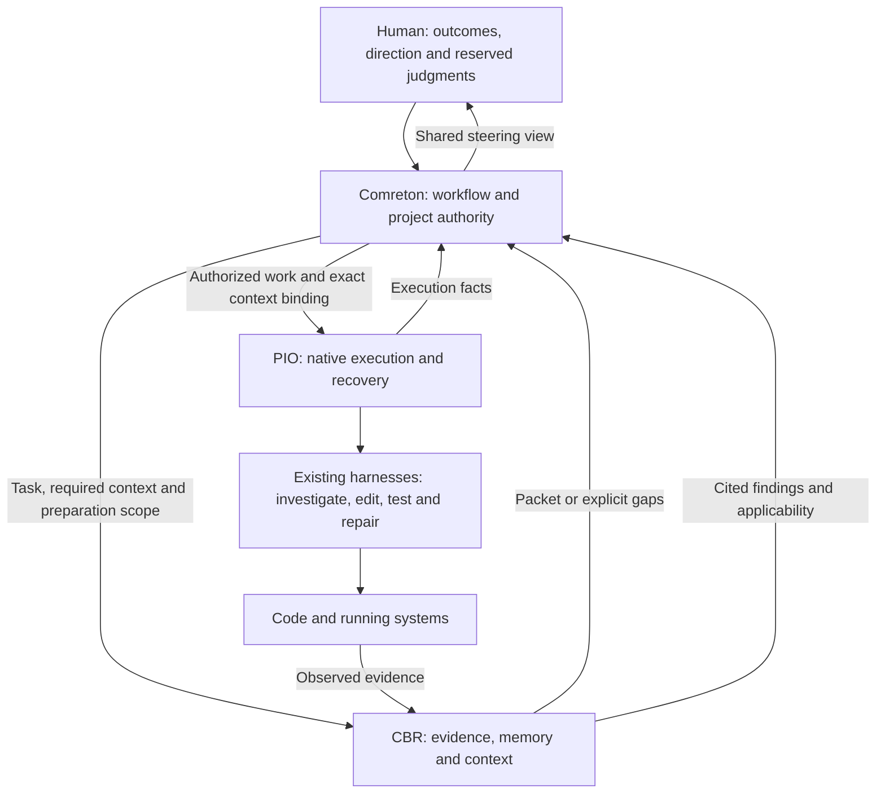

> Public edition `public-development-v1-20260913`. Adapted from the reviewed architecture baseline; names in the source may still say Comreton. See [publication and authority](PUBLICATION.md). Development sequencing is governed by [DEVELOPMENT](../DEVELOPMENT.md); self-development is deferred until all four usable v0.1 releases.

# Finalized architecture baseline

> Baseline `architecture-v1-20260912` · 12 September 2026. Finalized at the owner's request after architecture and research review. This records the agreed architecture and build sequence; it does not claim that software, wire schemas, integrations or performance have already been validated.

## 1. What we are building

Comreton is a human-steered spatial control plane for large greenfield and brownfield projects built with existing agentic harnesses. It must improve accepted outcomes and reduce reconstruction effort compared with disciplined use of those harnesses alone. Cost, latency and human attention count in that comparison.

These are service responsibilities, not mandatory workflow nodes. PIO, CBR and the protocol are independently usable. Comreton composes their public contracts; it does not replace their execution or memory stores.

## 2. Accepted architecture

| Area | Binding baseline |
|---|---|
| Control | Comreton owns selected direction, workflow readiness, project reliance/acceptance and branch adoption. PIO owns execution facts. CBR owns evidence and derived memory. |
| Autonomy | Routine investigation and repair continue within agreed scope. Keep work understandable. Request intervention for a needed change of direction, authority or reserved judgment. Block only transitions whose conditions are unmet. |
| Workflow | Executable nodes are existing harnesses. Native investigation/edit/test loops stay inside them. Typed edges, regions and contracts express control without fake harness nodes. |
| Templates | Optional methodology/configuration with stages and workflow blueprints. Instantiation creates concrete workflow revisions in a session. Standard and user templates share schema and operations. |
| Navigation | Continuous semantic zoom across orchestra, project, session and workflow canvases, with native harness detail. Stages add no containment level. Equivalent alternate views use the same operations. |
| History | Immutable revisions, retained branches and explicit successor/reuse operations. Restart does not undo external effects or resurrect missing evidence. |
| Persistence | Independent service authorities and transactional journals/outboxes, idempotent commands, observation frontiers and reconciliation. No shared writable database or fictional global transaction. |
| PIO mechanics | Journal invocation before dispatch, fence ownership, account for unresolved usage, publish immutable completion receipts, reconcile before retrying ambiguous effects. Advertise actual adapter capabilities. |
| CBR memory | Immutable evidence → validated typed revisions → derived indexes/views → exact task packets. Model assistance is central but cannot grant project authority or turn plausible prose into proof. |
| CBR runtime | Fixed calls plus bounded adaptive memory jobs. Durable progress outside model context, bounded calls/tool batches, explicit coverage and fresh working sets. No mandatory million-token model. |
| Preparation | Bounded background consolidation in the maintenance loop; immediate access to recorded binding corrections; progressive task-directed brownfield assimilation; modest greenfield capture from the beginning. |
| Timely context | Caller-selected advisory, required-before-transition or required-before-start obligations. CBR reports material/gaps; caller selects readiness; PIO executes the bound request. Deadlines do not supply evidence or consent. |
| Programmatic investigation | Optional constrained worker capability. Start with deterministic batching and direct calls. Generated programs/subcalls need host-enforced scope and aggregate limits. A full coding-agent fork is not a prerequisite. |
| Human understanding | A shared projection connects outcome, selected approach, expected path, actual evidence, divergence and pending judgments. Delivery, comprehension and successful behavior remain different facts. |

Reasons and alternatives are in [DECISIONS](DECISIONS.md). [CBR preparation and delivery](https://github.com/Combraton/cbr/blob/main/docs/spec/PREPARATION-AND-DELIVERY.md) defines the new timing contract; the shared and domain chapters elaborate the other contracts.

## 3. Implementation selections with a defined resolution point

These are unselected components or values, not an invitation to redesign accepted boundaries. During a later authorized build, make ordinary implementation selections with evidence and record their scope. Escalate only changes to architectural invariants, actions outside authority or choices requiring a product decision.

| Selection | Starting point | Milestone and evidence |
|---|---|---|
| Service language/persistence packages | Rust/Tokio, SQLite and content-addressed payloads are reference implementation preferences | Phase 1: transaction/recovery and supported-platform packaging proof; record alternatives if these fail |
| Wire schemas/framing/digest encoding | Versioned profiles; local JSON-RPC over authenticated sockets/pipes | Phase 1: explicit schemas and positive/negative conformance fixtures before dependent interoperability |
| CBR provider/agent library | Provider abstraction, fixed calls and small CBR-owned tool loop | Phase 3: native-loop versus lightweight SDK comparison; context control, cancellation, capture, usage and restart proof. Pi/Prime are assessed sources, not dependencies selected by this baseline |
| Generated-program backend | Optional; deterministic tools suffice initially | After core memory proof: sandbox, resource and provenance fixtures plus measured benefit before enabling |
| Models, limits and scheduling | Qualified models, explicit configurable limits; foreground needs precede optional maintenance | Phase 3: outcome quality at supported capacities and total cost; publish defaults and degraded behavior |
| OS enforcement/harness support | Truthful enforced/mediated/cooperative capability reporting | Phase 2: real adapter/version, surviving-process and external-effect fault tests |
| Spatial renderer | Semantic scene independent of library | Phase 1 prototype: continuous zoom, multiple workflows per session, keyboard equivalence and history inspection |
| Grants and attention defaults | Scoped autonomy and named consequential boundaries, no approval per routine experiment | Integrated evaluation: unnecessary interruptions and human reorientation versus strong native baseline |
| Repository slugs/releases | Four independent product/protocol repositories under Combraton | Resolved: combraton, pio, cbr and protocol; repository setup is documented in DEVELOPMENT.md |

The runtime's 32k allocation is illustrative. There is no approved universal confidence threshold, consolidation frequency, model choice or recursion depth. Missing required configuration produces an explicit setup/unsupported result, never an invented grant. Selection tasks must publish a decision record with the candidate/version, tested fixtures, limitations and fallback before their dependent milestone can pass.

## 4. First end-to-end proof

Use the worker-v2 migration in [FLOWS](FLOWS.md): preserve the API, implement locally and keep production outside the development grant. A successful response still runs through worker v1; runtime evidence reveals the mismatch. Scoped diagnosis and repair continue automatically. A repair needing an API change waits for the actual direction decision. Adoption and production effects have their own conditions.

Also exercise a late correction during context preparation, missing required context, a consumer that would otherwise hold its preparation resource, lost acknowledgment, false completion and branch restart. Encode expected behavior in fixtures before claiming end-to-end success.

## 5. Authority and proof

[HANDOFF](HANDOFF.md) is the new-session entrypoint. This baseline and [DECISIONS](DECISIONS.md) establish accepted choices; shared/domain specs elaborate them. Conceptual sketches are not published APIs. Historical research and original documents do not override this baseline.

The [public import manifest](source-import.json) records the original and adapted file hashes for this edition. [Publication provenance](PUBLICATION.md) identifies the transformations and ownership. Future architecture changes require an explicit successor/change record; Git preserves previous public revisions. The local HTML edition and its manifest are not included here.

Documentation checks establish readable diagrams, source consistency and local links. Product correctness, security, latency, memory quality and benefit require the acceptance work in [PLAN](PLAN.md).
