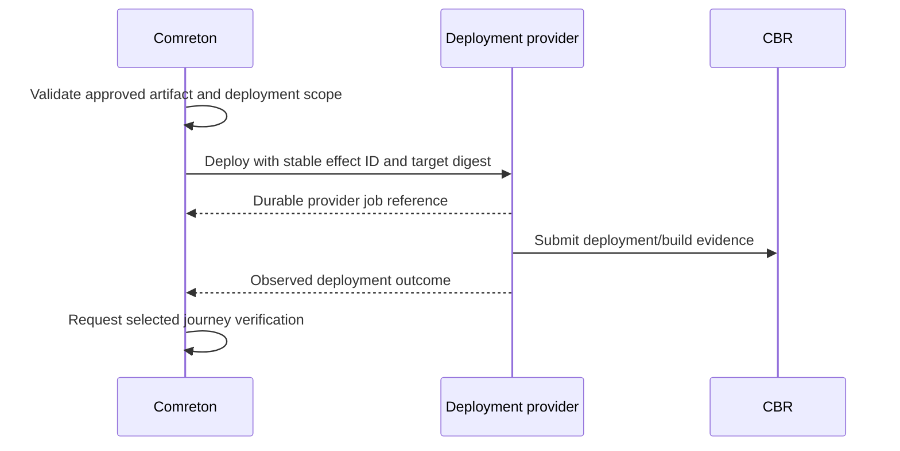

> Public edition `public-development-v1-20260913`. Adapted from the reviewed architecture baseline; names in the source may still say Comreton. See [publication and authority](PUBLICATION.md). Development sequencing is governed by [DEVELOPMENT](../DEVELOPMENT.md); self-development is deferred until all four usable v0.1 releases.

# Future systems and independent applications

> Current specification in [architecture-v1-20260912](BASELINE.md). Conceptual contracts are implemented and verified through [PLAN](PLAN.md).

## 1. Extension categories

| Participant | What it contributes | What it cannot assume |
|---|---|---|
| Harness adapter | Execution through an existing agentic harness | Project acceptance authority |
| Evidence observer | Git, runtime, CI, browser, security, design, or other observations | That an observation automatically becomes accepted truth |
| Context provider | Search, retrieval, summaries, bounded context | That it may broaden data visibility |
| Verifier | Typed property evaluations with evidence | Direct gate mutation |
| Effect provider | Deployment, issue update, environment management | Permission from merely being installed |
| Application client | Another UI, CLI, editor, or product consuming operations and views | Private database access |
| Controller | Another independent workflow owner using PIO/CBR | Concurrent authority over a Comreton-bound scope |

Comreton remains the controller when a participant plugs into a Comreton project. The protocol also permits independent applications outside that profile.

## 2. Registration and discovery

```text
ProviderDescriptor
  provider identity / implementation version / endpoint
  supported protocol majors and profiles
  operations, capability predicates, required rights
  input/output schema references and size limits
  health and replay/reconciliation guarantees
  artifact transfer and retention support
  trust zone and owner
```

Registration records availability; it grants no rights. Project binding selects a provider for a role, grants narrow access, and pins relevant semantics. Capability changes are versioned observations. A disappearing provider cannot rewrite a completed attempt or cause another provider's output to inherit its identity.

## 3. Example: a deployment service



Deployment is an attached provider effect, not a fake harness node. A harness can plan/operate it within a workflow under granted scope. The provider must expose lookup by effect ID or declare ambiguity on retry. A “deployment succeeded” receipt does not replace a required journey check.

## 4. Example: CBR used by a different application

An IDE plugin asks CBR for a packet about a selected subsystem at a specific tree. It submits test output afterward. It does not create a template or workflow. Its local acceptance scope is bound to the developer/policy in that application. If the same evidence is later used by Comreton, it retains origin and undergoes Comreton's reliance checks.

Within that grant, CBR may inspect scoped evidence and refresh an artifact while preparing the IDE's packet. Its internal memory-job and model-runtime choices stay private. The caller must authorize investigation/spending separately from the packet's output-size limit. An alternative context provider needs the negotiated public semantics, not CBR's SDK, checkpoint layout or database.

## 5. Example: issue tracker or design tool

An issue tracker proposes a work objective and links a changed requirement. Comreton records the proposal; selected project policy or the human adopts it. A design application exports a versioned artifact and review evidence. It cannot silently change the workflow merely because a file was edited externally.

## 6. Federation

A remote machine advertises execution capability and accepts a scoped work contract. It owns its harness credentials, process state, and usage observations. Comreton owns the local workflow and acceptance decision. Artifact exchange uses scoped read/write grants and verified digests; credentials and subscriptions are not shared.

Network partition means remote execution may still be active. Do not launch a replacement against the same external resource unless the old authority is fenced or the operation's idempotency/reconciliation contract permits it. A local “cancel sent” indicator is not proof of remote cancellation.

Returned patches are candidate artifacts. Integration creates a new subject and runs required proof. Remote signatures identify the producer under the configured trust policy; they do not certify correctness.

## 7. Authority transfer

Prefer distinct scopes and artifact exchange to moving a live acceptance authority. If transfer is needed, quiesce the old writer, export state/dedupe/reconciliation obligations, establish a higher epoch through an authority capable of fencing the old writer, and activate the new owner. If the old writer cannot be fenced, create a clearly named new lineage; never claim safe single-writer transfer.

## 8. Extension limits

Plugins do not install arbitrary executable template scripts. Templates reference typed graph, region, artifact, and contract semantics. New semantic operations require versioned profiles, compatibility rules, and conformance fixtures. UI extensions render bounded data through supported surfaces; they do not inject uncontrolled authority code into the core.

Packaging, signing, revocation, sandbox compatibility, and licenses are assessed before implementation/adoption. No unverified license table from the earlier research is treated as a permanent technical constraint.
