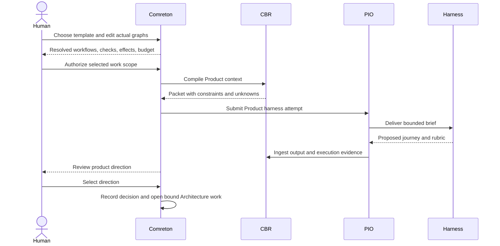
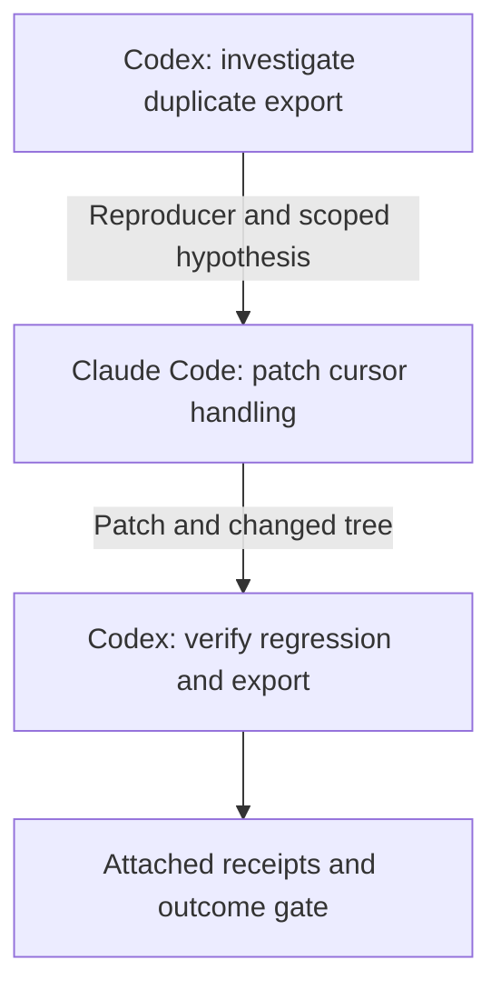
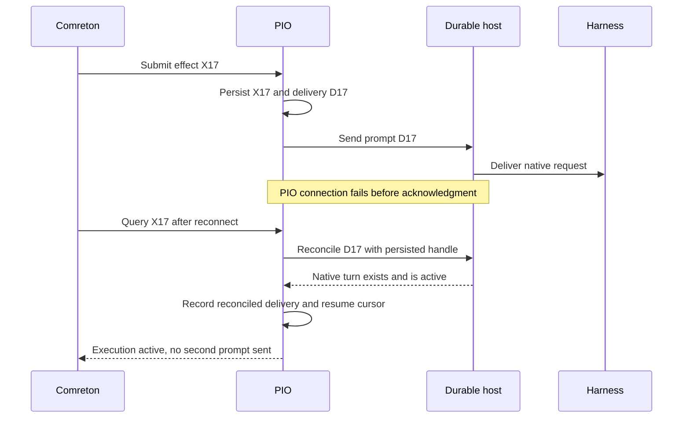

> Public edition `public-development-v1-20260913`. Adapted from the reviewed architecture baseline; names in the source may still say Comreton. See [publication and authority](PUBLICATION.md). Development sequencing is governed by [DEVELOPMENT](../DEVELOPMENT.md); self-development is deferred until all four usable v0.1 releases.

# Worked flows

> All names and IDs below are illustrative. These examples describe the accepted target system, not executions performed during this architecture work.

## 1. Greenfield: build a document-generation application

The human creates a project and a work session: “Upload a PDF and turn it into a readable visual explanation.” They choose the optional Product → Architecture → Program Design → Visible Vertical Slices template.

Comreton resolves the template into concrete graphs. Product contains Claude Code exploration followed by a Codex challenge. Architecture contains two workflows: system boundaries and failure/recovery. Program Design consumes their selected outputs. The slice workflow contains implementation, review, and verification harnesses. No stage is a harness node.

The human's Product decision is normative. CBR does not pretend that the proposed application already exists. The selected architecture describes intended runtime behavior, and the proof plan names observations that would demonstrate it.

The Program Design stage translates those choices into concrete responsibilities, types, data paths, failure handling, and test distinctions. An implementation workflow begins only because this particular template instance selected those requirements and its gates passed. A direct workflow in another project would not need them.

The first visible slice implements upload → request → worker → result display. PIO captures the changed tree. The verifier harness runs a journey against build B31. CBR preserves the trace and resulting artifact; Comreton evaluates the selected properties and asks the human for the qualitative judgment the contract requires.

## 2. Brownfield: direct workflow with no template

The human opens an existing repository and draws three harnesses: investigate, patch, verify. They select a narrow goal: “CSV exports include duplicate rows after pagination.” No Product, Architecture, or Program Design stage is created.

The first attempt is read-only investigation. CBR receives anchored source observations and a reproducing case. A hypothesis says the cursor is reused after an empty page; it is labeled proposed. A test demonstrates the issue at the current tree. The human or existing project policy authorizes a scoped patch.

Comreton binds only the requested reproducer and verification properties. `architecture_artifact=not_requested` is valid. PIO prepares an isolated workspace for the write attempt, receives the patch, and reports the resulting code state. Verification checks the changed subject, not the original tree.

The accepted session record explains the bug, patch, proof, and remaining limitations. A later harness can retrieve it by subsystem and code anchors rather than reconstructing the entire conversation.

## 3. “All tests pass” but the application still uses the old path

Suppose a migration adds worker v2, but the deployed configuration still selects v1.

| Step | What happens | What the system records |
|---|---|---|
| 1 | Human selects v2 architecture | Normative decision `desired_route=v2` |
| 2 | Implementation adds v2 code | Code observation at tree T31 |
| 3 | Unit/integration tests pass | Receipts for those properties and subjects |
| 4 | Browser journey returns a result | Journey observation at environment E7 |
| 5 | Correlated runtime trace identifies v1 | Observed route for that request/build/configuration |
| 6 | Gate compares required v2 path to observation | Failed path property and explicit drift record |

The system neither invalidates the human's intent nor erases passing tests. It explains the missing connection: this journey did not exercise the selected architecture.

The canvas highlights the failed path property and affected transition. Routing repair or additional instrumentation proceeds automatically when already within scope; the human need not approve a known repair. The user can still steer, inspect evidence, or change the intended architecture. A needed direction change outside delegation becomes a pending decision. Native repair may continue in the same harness; a changed graph uses a successor revision. None silently marks the result accepted, blocks unrelated work, or gives local coding work production authority.

A negative-control fixture later forces v1 and requires the v2-path assertion to fail for the expected reason. That gives us evidence the check detects this wiring mistake.

## 4. Lost acknowledgment during an expensive attempt

PIO records delivery intent D17, sends the prompt to a harness, and loses its connection before recording the response. The harness may already be editing files.

If the host cannot establish whether the prompt ran, PIO reports ambiguity. Comreton blocks only dependent unsafe retry/adoption, retains the budget uncertainty and workspace, and requests recovery. A timeout is not used as evidence that nothing happened.

If a replacement attempt is eventually authorized, it gets a new ID and an independently safe workspace/effect scope. Any late output from the first attempt remains attached to the first attempt. It cannot complete the replacement.

## 5. Architecture fails midway through a template

The Architecture stage produced two selected artifacts: protocol design A4 and storage design S3. Program Design and implementation have started. A runtime experiment shows that S3's assumption about concurrent writes is wrong.

1. The human opens the relevant evidence and records a challenge against that assumption.
2. CBR identifies dependent claims, packets, and artifact bindings. Protocol design A4 is not automatically invalidated if it does not depend on the assumption.
3. Comreton re-evaluates conditions and holds only admission/adoption/effects that require the invalidated assumption. Authorized investigation and repair continue. Existing attempts may continue independent work or an isolated experiment, finish, or be interrupted under policy; their records remain on the retained branch.
4. The human branches from the architecture checkpoint and replaces the storage workflow.
5. The restart preview proposes reusing A4 after checking its input basis, re-running S3's successor, and rebuilding downstream Program Design artifacts that depend on storage.
6. New workflows/runs/attempts receive fresh identities. The previous branch remains visible with failed proof and all available evidence.
7. Once the new direction is selected, the older branch may be archived. Pruning is a separate action with its own impact preview.

The template's reusable catalog revision is unchanged unless the human deliberately saves the revised methodology. This separates fixing one project's instance from changing the standard template for future projects.

## 6. Return after a week

The desktop reconnects and loads a deterministic Pulse at a declared observation frontier. It shows completed work, meaningful changes since the last visit, repairs in progress, permission waits, unknown effects, expired runtime evidence, and pending decisions with their affected scope and next steps. It does not infer progress from a long absence.

The human zooms into a session and reads its before/after record. A new harness receives the selected project snapshot, relevant decisions, current code anchors, failed approaches, and unresolved questions in a bounded packet. Native resume is used only if the adapter can resume the intended checkpoint; otherwise the interface says “new conversation from project checkpoint.”

Background consolidation may have prepared a proposed summary. The human can inspect its sources. It has not silently promoted a workaround into a project rule or discarded an older experimental branch.

## 7. Two repositories and a remote harness

A frontend workflow and backend workflow produce separate patches tied to their repository trees. A remote participant implements one backend task using its own credentials. The integration workflow consumes both artifacts and creates a manifest naming both candidate trees and the environment configuration.

The resulting proof covers that multi-repository manifest. Passing the backend tests alone cannot accept the frontend journey. A disconnected remote participant stays possibly active; the local controller does not assume cancellation or auto-merge its later patch.

This uses the same node, artifact, verification, and history contracts as local work. Remote execution changes trust, delivery, and transfer guarantees, not what a workflow node means.

## 8. Small context request and CBR continuation

An IDE asks why a tool has different icons in modal and message-stream views. CBR binds the question to a code snapshot and read/effort grant. A maintenance artifact describes the modal path, but the message-conversion source changed. The request loop inspects bounded source spans, records the changed path and keeps the runtime explanation labeled as a hypothesis until the relevant behavior is observed.

If a model call approaches its context budget, CBR records the job's findings, original evidence references and unresolved dependencies, then continues with a fresh bounded working set. It does not feed an overflowing transcript into a summarizer or require a million-token model. If it cannot establish a material relationship within the grant, the packet carries the useful findings and the gap.

The packet contains the relevant flow, exact source references, interpretation, unresolved check and omitted-material references. It is a new immutable delivery artifact; it does not replace the reusable memory artifact or the selected view. Routine publication follows CBR policy without turning the hypothesis into a binding project requirement. If an existing harness is needed, CBR submits a separately authorized PIO execution and retains its identity; otherwise its configured model runtime handles the memory job directly. No Comreton workflow node is invented for this internal activity.

## 9. Migration: iterate freely, control the production transition

The user grants local implementation/testing of worker v2 while preserving API compatibility. Production changes require a separate authorization and named checks. PIO provides a development workspace and an actually enforced effect scope; a worktree alone is insufficient.

1. The harness writes a migration and runs it against disposable data. It fails. The failure is evidence, not an approval request; the harness diagnoses and retries within its grant.
2. Preview output succeeds but a trace reaches worker v1. CBR links the intended and observed paths to their decision/build anchors. Comreton shows the mismatch and keeps v2 acceptance closed. Scoped routing repair continues automatically.
3. A possible solution changes the public API. The harness can investigate alternatives within its grant, but cannot silently adopt that direction. Comreton presents the compatibility trade-off and holds only work needing that decision. Independent authorized work continues while the user is away.
4. The user selects compatibility over speed. Comreton records the decision; CBR refreshes relevant context; PIO reports actual steering delivery. Subsequent evidence, rather than the delivery acknowledgment, shows whether work followed the direction.
5. The repaired preview exercises worker v2. Its receipts establish only their covered properties. The production action remains unavailable until its own target-specific evidence and authorization conditions hold. The developer harness never receives unrestricted production credentials merely because a local test passed.

This uses the same harness nodes, typed conditions and immutable history as other workflows. It adds no mandatory template stage or per-tool approval. [STEERING](STEERING.md) contains the full interaction and remaining design choices.

## Context preparation during a brownfield repair

1. The human requests a duplicate-ingestion fix. Comreton selects the idempotency constraint and grants local investigation/repair. No whole-repository assimilation is required.
2. CBR inventories relevant entry points and retrieves the retry-flow artifact. It preserves source/environment identity and marks concurrent-delivery behavior unknown.
3. Advisory context allows investigation to start. If a specific initial constraint is required, the consumer waits without holding the PIO slot needed by a separate preparation job.
4. CBR supplies an exact packet. PIO records delivery to the native harness; the harness investigates, edits and tests freely within scope.
5. A failed concurrency test feeds repair and becomes new evidence. It blocks only the selected acceptance/effect condition that requires it to pass.
6. The human corrects a requirement while background consolidation is running. The authoritative correction is immediately available on the next governed path; an older derivation cannot replace it. Supported steering delivers a versioned update, with receipt distinct from observed compliance.
7. CBR retains a small revised flow, test evidence and the rejected approach. Later work can reuse them if their dependencies still apply. Cold preparation and refresh costs remain part of the outcome comparison.

[PREPARATION-AND-DELIVERY](https://github.com/Combraton/cbr/blob/main/docs/spec/PREPARATION-AND-DELIVERY.md) specifies the same behavior across standalone and integrated use.
