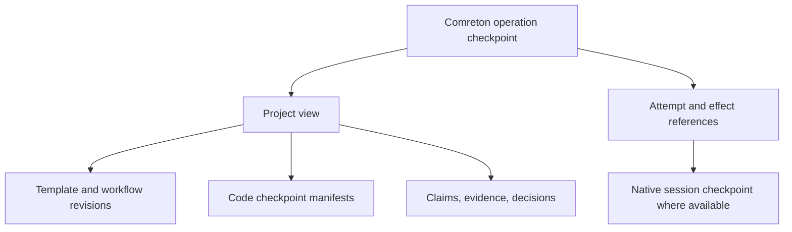
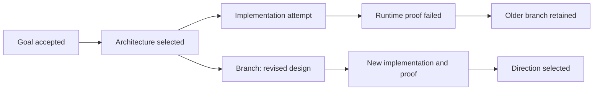
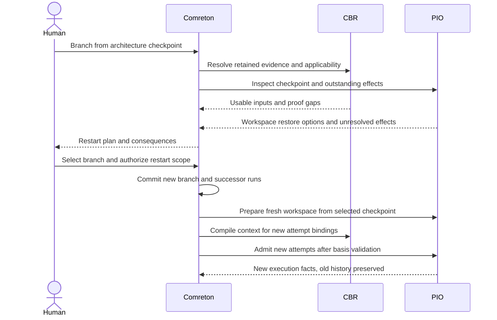

> Public edition `public-development-v1-20260913`. Adapted from the reviewed architecture baseline; names in the source may still say Comreton. See [publication and authority](PUBLICATION.md). Development sequencing is governed by [DEVELOPMENT](../DEVELOPMENT.md); self-development is deferred until all four usable v0.1 releases.

# History, branching, and restart

> Current specification in [architecture-v1-20260912](BASELINE.md). Conceptual contracts are implemented and verified through [PLAN](PLAN.md).

## 1. Four histories stay connected

Git records code history. Comreton records decisions, plans, branches, adoption, and execution relationships. PIO/native harnesses record execution and conversation histories. CBR records evidence and knowledge derivation. They connect through explicit references; none replaces the others.

A historical checkpoint can be fully inspectable but only partly restartable. The UI reports that difference before restart.

## 2. Operations and branches

An operation records its parent operations, actor, cause, prior view, and resulting view. A branch is a named pointer into that graph. Branch creation does not copy all evidence bytes; it creates references and retention roots.

Operation history and Git history have many-to-many relationships. A session can span several commits and uncommitted snapshots. Several sessions can investigate the same commit. Comreton does not fabricate a Git commit for every discussion or assume one session equals one commit.

## 3. What each action means

| Action | Meaning | External effects |
|---|---|---|
| Inspect at checkpoint | Read the recorded view and its evidence | None |
| Compare | Show semantic, code, contract, and evidence differences | None |
| Branch from checkpoint | Create a named alternative pointing to selected historical state | None until execution is explicitly started |
| Correct a claim/decision | Add a scoped successor or challenge with lineage | Re-evaluate dependent work; no automatic code rewrite |
| Retry node | New attempt with classified retry reason and explicit input bindings | May run again only under effect policy |
| Restart from checkpoint | New run(s) against restored/rebound inputs and fresh execution identities | Each effect reauthorized or explicitly reusable |
| Restore selected plan section | New operation selecting earlier template/workflow state | Does not roll back code or deployments |
| Revert an operation | Apply an inverse semantic patch to current state after conflict checking | Requires a separate compensation for external actions |
| Adopt another branch | New target view after semantic and code integration review | Code integration and deployment are separate actions |
| Archive branch | Hide by default while preserving references and retention | None |
| Prune branch | Remove chosen history payload roots after impact review and grace period | Does not delete another owner's resources implicitly |

## 4. The restart contract

A `RestartPlan` contains:

- source operation and selected plan sections;
- new branch and run identities;
- code checkpoints for every relevant repository, including dirty/untracked content if captured;
- native-session choices: resume at exact supported boundary, fork, or start fresh;
- exact context/evidence view, followed by a present applicability check;
- outputs proposed for reuse, their evidence, and the checks required before reuse;
- unresolved external effects, compensations, and environments that must be rebuilt;
- permissions and budget for new work;
- unavailable inputs and the nearest feasible checkpoint if an exact restart is impossible.

The preview explains practical consequences: “restore this source tree into a new workspace; keep the previous branch; start Claude Code with a new conversation; re-run the journey because its old environment no longer exists.”

## 5. Restart sequence

An existing sufficiently scoped grant can authorize routine restart; the product need not demand another click for every retry. A changed direction, permission scope, or non-repeatable external effect needs an explicit decision according to policy.

## 6. Reuse has to prove equivalence of the relevant inputs

Artifact reuse is different from execution replay. Reusing a reviewed design document avoids another model call. Reusing a patch still requires applying it to the selected code tree and checking the resulting subject. Reusing a prior runtime receipt is valid only for the exact scope its contract permits.

Reuse checks compare artifact digest, relevant input versions, contract, policy, code/environment anchors, observation coverage, and evidence availability. An output cache hit does not create a fictional new execution or new human approval.

A model-backed attempt is not assumed deterministic. Exact previous output can be selected as an artifact; identical prompts do not guarantee a new model run would reproduce it. Effects such as deployment or external sends never become “reusable” simply because the prompt hash matches.

## 7. Mid-run changes and late results

For a selected graph edit/restart, pause only admission that must move to the successor, identify active attempts, and choose to finish, interrupt, or detach them into the retained older branch. Routine investigation/repair within an unchanged grant does not require this graph-edit procedure; a failed check alone does not restart or pause the whole session. New work executes a successor run. Old attempts retain their original graph, brief, workspace, receipt subject and authorization history. Historical grants do not override subsequent revocation; tightened authority applies through supported effect boundaries and reconciliation. See [STEERING](STEERING.md).

If an old attempt later succeeds, record it under its original identity. It cannot advance the successor run. The human may inspect and explicitly adopt its artifact after fresh validation.

An authority-changing edit from a stale canvas or CLI view uses compare-and-set and receives a semantic conflict response. It is not silently merged because the author is a machine. Geometry-only edits can use an independent presentation revision; they cannot weaken a gate or change a target workspace.

## 8. Code checkpoints

For a clean Git checkout, a commit/tree reference plus retained objects can identify source. For a dirty checkout, record the base, index state if relevant, tracked changes, included untracked content, file modes, and explicit omissions. A SHA alone does not capture uncommitted work. Submodules, LFS objects, generated inputs, and multi-repository dependencies need their own descriptors.

PIO creates checkpoints only within its authority. It does not commit to the user's branch merely to make history easier. An opt-in private Git ref or content snapshot can retain needed bytes without changing the checked-out branch. Non-Git work uses a scoped content manifest with declared limitations.

Databases and deployed services require provider snapshots or reconstruction steps. If those are absent, Comreton can restore the plan and source but must label the environment as reconstructed or unavailable.

## 9. Retaining alternatives

Every retained branch is a garbage-collection root, including unsuccessful experiments. Active runs, checkpoints, decisions, and cited proof preserve their dependency closure. Archive changes visibility, not retention eligibility.

Ordinary branch pruning follows selection of a direction, an impact preview, a retention grace period, and a final reachability check. The preview distinguishes metadata, reproducible cache, unique evidence, code checkpoints, and native transcript references. It shows which future inspections or restarts would become impossible.

Explicit privacy deletion is a different operation and may intentionally destroy proof. It leaves the permitted audit/tombstone metadata and propagates the loss. “Full history” means retained semantic history with declared payload coverage; it is not a promise to retain secret or purged bytes forever.
