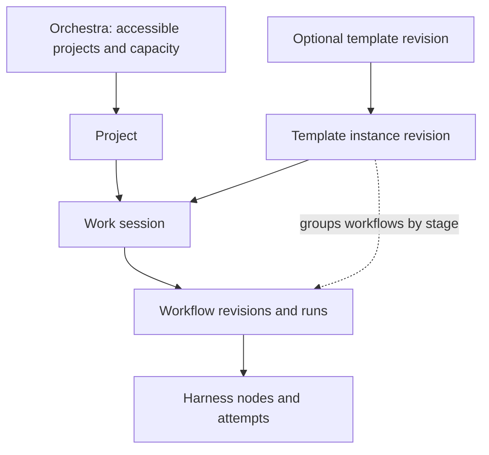

> Public edition `public-development-v1-20260913`. Adapted from the reviewed architecture baseline; names in the source may still say Comreton. See [publication and authority](PUBLICATION.md). Development sequencing is governed by [DEVELOPMENT](../DEVELOPMENT.md); self-development is deferred until all four usable v0.1 releases.

# Domain model and invariants

> Accepted semantic responsibilities in [BASELINE](BASELINE.md). Record sketches establish identities and ownership; Phase 1 freezes concrete interoperable schemas.

## 1. Containment is not execution



| Entity | Meaning and identity | Mutable part |
|---|---|---|
| Project | Stable project ID with repositories, environments, intent, policy, and work history | Named branch heads and configuration pointers |
| WorkSession | Long-lived scope of an objective; can span native sessions and days | Current revision/head, through operations |
| Template | Catalog identity for a reusable methodology | Latest revision and catalog visibility |
| TemplateRevision | Immutable stages, parameters, blueprints, artifact slots, and checks | None |
| TemplateInstanceRevision | Immutable resolved parameters, role bindings, stage grouping, and generated workflow mappings for a session | None; edits create another revision |
| Workflow | Stable lineage for one actual harness graph | Latest revision pointer |
| WorkflowRevision | Immutable nodes, ports, handoffs, regions, checks, and permissions requested | None |
| WorkflowRun | Execution of one pinned workflow revision against selected inputs | Derived lifecycle from events |
| Attempt | One execution of one harness node occurrence, including loop occurrence and retry number | Derived lifecycle; identity and brief stay fixed |
| NativeSession | A harness-owned conversation ID plus adapter/version/host identity | Harness-specific state, observed through PIO |
| Workspace | Repository checkout or non-Git directory with isolation and ownership metadata | Observed bytes; controlled write lease |
| ProjectRevision | Immutable view manifest tying selected plans, decisions, evidence, and code references together | None |
| Operation | A historical transition with parents, actor, reason, before/after references | None |
| Branch | Named alternative project direction | Head moves through compare-and-set operations |

A work session can contain multiple template instances and direct workflows. Workflows have stable IDs distinct from revision IDs. A stage name is a string in template data, never a global enum.

## 2. Execution identity must survive ambiguity

```text
AttemptBinding
  project / session / branch / workflow_run / node_occurrence
  attempt_id / retry_number
  brief_digest / contract_digest / context_binding
  input_manifest_digest / allowed_effects / budget_reservation_id
  PIO execution_id / native_session_ref
  launch_generation / controller_epoch / workspace_lease_epoch
```

Context binding records an exact packet digest or an explicit permitted absence with its advisory/fallback basis; later updates have separate identities. Required initial context cannot use absence as a ready result.

An attempt ID identifies a logical execution; a process ID identifies an operating-system process. A native conversation may contain multiple attempts over time. One process may serve multiple conversations when the adapter explicitly supports that. A controller reconnect does not automatically mean a new attempt or a new process.

Use independent coordinates for lifecycle, delivery, result, and evaluation. “Waiting for permission” is not a failed execution. “Result received” is not accepted. “Stream disconnected” is not process exit.

## 3. Claims are scoped propositions, not free-floating facts

```text
ClaimRevision
  claim_lineage_id / revision_digest
  plane: normative | observed | interpretive
  subject / predicate / value
  scope: project, repository, branch, environment, subject qualifiers
  validity: observed or valid interval, where known
  provenance: evidence refs, transformation identity, dependency refs
  source author / derivation producer / lineage owner

RelianceDecision
  acceptance_scope / authority_binding / authority_epoch
  claim_revision / permitted_use / policy_or_human_decision
  validation_basis / accepted_or_rejected / rationale

ApplicabilityEvaluation
  claim_revision / target_anchor_manifest / evaluation_version
  applicable | needs_check | invalid_for_target | unknown
  dependency coverage / causes / evidence availability
```

The original evidence and claim statements do not change when we discover something new. Supersession, rejection, challenge, and corrected validity intervals are later events. Querying a historical checkpoint reconstructs what was known then; querying present knowledge about a past interval includes later corrections. These are separate queries.

Do not make one status field carry acceptance, freshness, health, and proof availability. A historically accepted claim can have missing evidence today. A current observation can report unhealthy runtime. A rejected architecture can still be preserved as a valid historical decision.

## 4. Conflict and drift

`ConflictRecord` holds mutually incompatible claims about the same appropriately qualified subject, predicate, scope, and overlapping validity. A multi-valued selected slot prevents accidental selection while a conflict is unresolved. The record preserves the reason, evidence, candidate set, and resolution history.

`DriftRecord` compares desired state with observed state. Example: `desired_route=v2` and `observed_route=v1` is a gap, not evidence that either record is intrinsically false. Claims from different environments or times may coexist without conflict.

Resolution can select a proposal, narrow scope, reject support, supersede a decision, or request a discriminating observation. Recency and model confidence alone never resolve a conflict. A downstream contract declares whether it requires a resolved value or can explicitly explore alternatives.

## 5. Artifacts, slots, evidence, and receipts

An artifact is a typed object or payload: a design document, patch, screenshot, trace, or test result. An artifact slot is a named requirement in a template or workflow, such as `architecture.selection`. A concrete binding fills that slot with an immutable artifact revision.

An evidence descriptor records owner, content digest, media type, size, producer, capture anchors, visibility, and retention handle. A receipt is a structured statement about a particular attempt or verification. It cites exact subject digests and distinguishes pass, fail, not evaluated, and indeterminate properties.

Inputs carry a reliance mode: `binding`, `evidence`, `hypothesis`, or `reference`. A packet must preserve these labels. An agent's confident wording cannot promote reference material into binding policy.

### CBR memory work identities

| Concept | Identity and meaning | Ownership limit |
|---|---|---|
| Memory artifact revision | Reusable explanation, flow, finding or progress record with immutable content, support, scope and derivation | Publishing an interpretation is not accepting a project requirement |
| Memory view | Selected artifact/claim revisions, authority inputs, source basis and coverage | Distinct from Comreton's broader ProjectRevision; not a simultaneous world snapshot |
| Context packet | Exact delivered content, target binding, citations, omissions and compiler/job provenance | Distinct from memory artifacts and internal working context |
| Memory job/checkpoint | Goal, pinned view, permitted tools, progress, source references, unresolved frontier and budgets | CBR-internal work; not a project WorkflowRun or harness node |
| Model invocation | One observable provider call with input/output records and usage coverage | Re-running a model creates a new derivation; an SDK transcript is not canonical authority |

These are conceptual record responsibilities; public schema names/fields remain to be frozen. If a memory job delegates an existing harness through PIO, retain the separate PIO execution identity and causal binding. A direct model call does not invent a PIO execution or require a Comreton workflow. Exact artifact prose/model output is retained as an immutable payload; rendered pages and search indexes remain replaceable projections. See [CBR runtime](https://github.com/Combraton/cbr/blob/main/docs/spec/MODEL-RUNTIME.md).

## 6. Read sets and acceptance

```text
ValidationBasis
  selected branch and expected target revision
  contract and policy digests
  relevant input revisions and dependency coverage
  code tree / dirty snapshot / environment / build identities
  provider observation frontier
  authority and permission epochs
```

An acceptance operation validates this basis. If only an unrelated project object changed, the result may still be applicable after recorded revalidation. If the target code, selected requirement, or relevant observation changed, acceptance is rejected or requires new proof. Unknown dependency coverage requires a conservative target scope.

### Transition conditions and steering projections

A gate identifies its governed action or reliance decision, subject/environment, required properties or reserved judgment, authority, relevant validation basis and affected dependencies. It must distinguish those conditions from authorization to investigate or repair. A failed receipt is an observation; whether it prevents a transition follows that transition's selected contract. Native harness iteration within scope is not a succession of workflow graph revisions.

The shared steering view references existing intent/design decisions, expected behavior artifacts, observed evidence, drift/conflict records and pending judgments at a declared observation frontier. It introduces no independent selected head or executable node. Distinguish not-requested information from missing required evidence, and suspected mismatch from a located observation. A decision record, delivery receipt and observation of compliant behavior remain different facts. See [STEERING](STEERING.md); exact public fields remain to be finalized.

## 7. Invariants used throughout the specifications

- A command identity cannot refer to two payloads.
- Every accepted external effect has a previously durable authorization or explicitly scoped standalone caller request.
- One workspace write lease cannot authorize two conflicting writers.
- A retry creates a new attempt; an old result cannot silently complete the new attempt.
- A run's executable revision never changes.
- A template does not mint permissions, live sessions, accepted claims, or historical receipts.
- Only declared scheduling bindings create execution dependencies.
- Unsupported capability and missing observation remain explicit.
- Historical inspection never triggers effects.
- Branch selection does not undo code or external effects.
- Evidence cannot be ordinarily collected while a retained branch or active decision depends on it.
- Removing a provider cannot remove the semantic meaning of previously committed decisions.

These invariants are more stable than a programming language or transport library. [The plan](PLAN.md) tests them as cross-product contracts.

## 8. Context preparation and delivery bindings

A context request exists before its consumer execution does. Its identity binds task, authority, relevant source/environment manifest, read scope, required items, reliance labels, needed-before boundary, wait policy, deadline, investigation grant and output capacity. Link the eventual attempt without rewriting historical requests. Readiness is a caller/controller evaluation of the selected obligations; packet delivery is a separately observed execution fact.

Timing has three meanings: advisory enrichment, required before a named transition, and required before attempt start. It does not replace the binding/evidence/hypothesis/reference reliance modes. A deadline cannot waive a binding rule. Shared preparation has compatible scoped subscribers and an independent resource grant; canceling one subscriber does not erase others.

A memory view records multiple producer frontiers and source coverage, not a global sequence. Exact packets and later versioned deltas retain included artifact revisions, authority basis, omissions and actual delivery observations. Revalidate relevant dependencies at governed boundaries. See [CBR delivery](https://github.com/Combraton/cbr/blob/main/docs/spec/PREPARATION-AND-DELIVERY.md).
