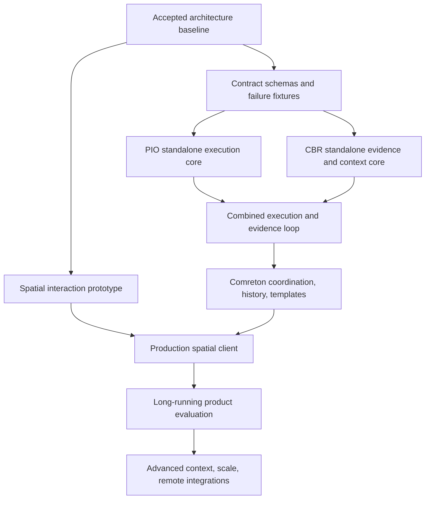

> Public edition `public-development-v1-20260913`. Adapted from the reviewed architecture baseline; names in the source may still say Comreton. See [publication and authority](PUBLICATION.md). Development sequencing is governed by [DEVELOPMENT](../DEVELOPMENT.md); self-development is deferred until all four usable v0.1 releases.

# Build and evaluation plan from the finalized baseline

> Architecture Phase 0 is complete in [BASELINE](BASELINE.md). A later build instruction selects the implementation phase; begin with Phase 1 contracts and spatial validation. No product implementation was performed by this documentation task.

## 1. The build strategy

Design the complete product now, then prove its difficult contracts in dependency order. PIO and CBR each need standalone quality. The spatial interaction needs early validation. The integrated control loop must be evaluated before broad feature expansion.

Recommended independent repository boundaries under the Comreton organization are `protocol`, `pio`, `cbr`, and `comreton`; names are proposals, not created repositories or verified available slugs. Each has its own releases and compatibility policy. Cross-repository fixtures belong to the protocol/conformance package, while product-specific fixtures stay with their owners.

Do not carry the old implementations forward by default. Use them as lessons, fixtures, and possible explicitly assessed reuse candidates. The accepted baseline governs new implementation boundaries.

## 2. Dependency map

Prototype and schema work start under the later authorized Phase 1 build task. Independent work can proceed against the accepted boundaries; it cannot invent incompatible private contracts.

## 3. Phase 0: finalized architecture baseline

Completed as documentation in [BASELINE](BASELINE.md) and [DECISIONS](DECISIONS.md): product invariants, ownership, conceptual contracts, history, initial migration scenario, alternatives and evaluation sequence. Package versions and wire schemas were not frozen by prose.

Phase 1 translates the normal attempt, lost acknowledgment, false completion, branch restart and template counterexamples into executable fixtures. Any inconsistency exposed there is a specific change request, not a reason to silently replace the architecture.

## 4. Phase 1: protocol and executable conformance fixtures

Define Core, Execution, Evidence, Knowledge, Context, and Verification schemas; coordination schema follows the agreed model. Specify transport framing, canonical digest rules, idempotency horizon, grants, cursors, errors, artifact seal/hold, and compatibility rules.

Build deterministic fake providers and event fixtures. They should simulate duplicate commands, stale epochs, partial uploads, sequence gaps, delayed completion, storage failures, and absent capabilities. Do not build a generic plugin platform first.

Exit condition: a minimal third-party executor and evidence producer can participate without linking Comreton internals. Unknown required semantics and conflicting command payloads are refused consistently.

In the same phase, prototype the spatial grammar using inert fixtures: zoom through project/session/workflow/node, draw a loop/gate, inspect evidence, branch history, and operate with keyboard equivalents. Select the renderer only after the same scenarios have been demonstrated and measured.

## 5. Phase 2: PIO as a real independent runtime

Build durable request admission, execution hosts, workspace policies, controller leases, output spooling, lifecycle facts, cancellation, and reconciliation. Implement one structured harness adapter, then a second with different native lifecycle semantics; recommended first pair is Codex and Claude Code. Add ACP mapping as a separate adapter surface with explicit version negotiation.

Bring up a usable CLI/TUI so PIO is not waiting for Comreton to become useful. Add permission enforcement reporting, provider quota/usage coverage, and native session handoff. Read-only/non-Git work must work without creating a Git repository.

Implement the [PIO internal contracts](https://github.com/Combraton/pio/blob/main/docs/spec/INTERNALS.md): mandatory invocation journaling, fenced claims, locally serialized budget reservations, pending-liability accounting, immutable completion receipts and bounded metadata reads. Fault fixtures must include an expired claim with a surviving writer, duplicate/conflicting receipt publication, unknown usage after timeout and restoration against a live host. Report adapter enforcement limits instead of promising hard limits for opaque calls.

Exit condition: repeated process/daemon interruption across launch, delivery, execution, approval wait, and completion cannot create a fictional success or silently duplicate unsafe work. Actual real-harness capability results are recorded by version. Fake-provider tests alone do not satisfy this exit.

## 6. Phase 3: CBR as a real independent service

Build evidence sealing, scoped claims, provenance, explicit reliance records, history, applicability evaluation, conflict/drift separation, and bounded packets. Start with lexical/identity/code-anchor retrieval and a transparent dependency evaluator. Build model-assisted derivation as a first-class capability, with actual inputs/outputs recorded outside deterministic reducers. Preserve exact delivered packet bytes.

Implement the [CBR internal contracts](https://github.com/Combraton/cbr/blob/main/docs/spec/INTERNALS.md): one typed patch commit path, parent/touched-revision checks, recorded transformation outputs, scoped entity lineage, build manifests and explicit index coverage. Rebuild semantic views from retained canonical records; a model rerun creates a new derivation. Test conflicting branch requirements and concurrent corrections without silently replacing either history. Keep advanced graph retrieval and learned memory policies behind measured need.

Build the [maintenance and request-time loops](https://github.com/Combraton/cbr/blob/main/docs/spec/MEMORY-ENGINE.md) and [bounded model runtime](https://github.com/Combraton/cbr/blob/main/docs/spec/MODEL-RUNTIME.md) in the first credible intelligent-memory version. Direct calls handle fixed jobs; scoped tool iteration handles investigation. Checkpoint job state outside model context, cap aggregate tool output and each serialized call, and return explicit missing coverage on exhaustion. Include small search/flow/log artifacts. A lexical-only foundation is an intermediate milestone, not completion of the confirmed CBR product direction.

Before selecting a runtime, compare a lightweight SDK adapter with direct provider calls and an appropriate native implementation. Test the actual context hooks, cancellation, replay/commit behavior and usage accounting. SDK choice, Rust/TypeScript packaging, model matrix and numerical budgets follow the selection milestones in [BASELINE](BASELINE.md); a million-token model is not a required dependency.

Create small, adversarial software-project fixtures: renamed function, stale feature flag, deleted evidence, unsupported claim, repeated agent agreement, wrong environment, compaction, changed policy, and a past fact learned later. Include dirty and multi-repository checkpoints.

Also test smaller supported context capacities, repeated checkpoint cycles, oversized tool batches, misleading summaries, unresolved cross-file dependencies and model/provider failure. Measure total internal-call cost and latency, omitted constraints, unsupported packet claims and downstream task success; a packet that fits its token limit can still be wrong.

Exit condition: CBR answers with correct scope, citations, and abstention; it does not auto-accept high-confidence prose, mark incomplete dependencies current, or reveal private source content through derived summaries. Compare packet-based work with native context before optimizing retrieval sophistication.

### Preparation and delivery in the first intelligent-memory milestone

Implement [CBR preparation/delivery](https://github.com/Combraton/cbr/blob/main/docs/spec/PREPARATION-AND-DELIVERY.md): bounded coalesced maintenance, immediate access to authority-supplied corrections, progressive orientation/task preparation, exact memory views and packet updates. Foreground needs must not wait behind unbounded optional consolidation. No global assimilation barrier or always-on model is required.

Phase 1 fixtures must first define advisory/start/transition requirements, source frontiers, budget/deadline separation, missing-item results and delivery semantics. Phase 3 proves correction races, dirty/multi-repository invalidation, canceled shared subscribers, context overflow, crash continuation and preparation/resource cycles. A required item stays unmet at deadline.

Deterministic batching and a bounded model/tool loop are the initial implementation path. Optional generated-program workers follow a separate capability spike after core memory proof: actual sandboxing, host-owned evidence capture, aggregate child budgets and recovery without heap state. Adopt a Pi/Prime component only after a pinned comparison; full-runtime reuse is not a prerequisite for completing the core milestone.

## 7. Phase 4: one integrated control loop

Connect PIO and CBR through public profiles. Add Comreton's durable project actor, outbox/inbox, validation basis, workflow readiness, contracts, and a minimal client for inspection. Use one real “code exists but wrong runtime path runs” fixture.

The human selects a goal; a harness produces a change; runtime verification distinguishes old/new paths; a failed property blocks its governed acceptance/effect transition while scoped repair continues automatically. Include one repair requiring no human click and another that requires a direction or authority decision. The human changes that decision; relevant context and execution are updated, using a successor run when the graph changes; a verified result follows. Interrupt this sequence at every durable boundary.

Exit condition: the story works end to end with source, execution, runtime, and adoption evidence. A passing component test is not accepted as the journey. Neither PIO nor CBR requires private access to Comreton's database.

## 8. Phase 5: templates, full history, and spatial steering

Implement catalog create/copy/edit/archive/import/export, blueprint extraction, instantiation source maps, cross-workflow bindings, and standard templates using the public schema. Include the direct-workflow and custom-template cases from the first UI milestone.

Implement inspect, compare, branch, correction, successor runs, reuse validation, multi-repository checkpoints, and retention of older alternatives. Add the production canvas, lenses, node interior/native-session view, session before/after records, Pulse, and optional Steward explanation.

Exit condition: a user can locate a wrong assumption, inspect evidence, branch from the relevant point, restart affected work, and compare alternatives without navigating a transcript or losing the original branch. Semantic edit conflicts and reduced observation coverage are visible. Templates add methodology without adding hidden universal gates.

## 9. Phase 6: sustained work and standalone releases

Run changing greenfield and brownfield projects across many work sessions, model context resets, harness swaps, daemon upgrades, and repository changes. Add backup/export/restore and fault-tested retention. Publish independent PIO/CBR/protocol releases only when their standalone fixtures pass.

Exit condition: the system preserves history and avoids invalid acceptance across the full longitudinal scenario; the human can explain what changed and why from the interface. Document measured cost, latency, recovery, and context performance. Do not extrapolate one successful demo to months of reliability.

## 10. Phase 7: advanced capabilities through the same contracts

Expand provider integrations, remote participants, collaboration/authority transfer, advanced retrieval/incremental evaluation, environment snapshots, more native adapters, and external document/report targets. Add indexing or scheduler complexity only when measured constraints justify it.

Exit condition: each addition passes profile fixtures and preserves standalone use, history, and human authority. The full product includes these capabilities; sequencing them later is a dependency choice, not removal from the target architecture.

## 11. Evaluation that can disprove our assumptions

Compare at least these arms with the same harness/model versions, task access, tool availability, effort budget, and acceptance rubric:

| Arm | What it measures |
|---|---|
| Native harness with disciplined repository instructions and Git | Strong baseline, not deliberately poor prompting |
| PIO alone | Value of execution continuity, supervision, workspaces |
| Native harness or PIO with CBR packets | Value and cost of memory/context |
| Full Comreton | Added value of workflow steering, contracts, history, spatial understanding |

Use paired equivalent tasks and repeated trials where possible; randomize order to reduce learning effects. Include greenfield feature work, brownfield bug repair, migration/path-selection, multi-session continuation, and failure recovery. Independent reviewers assess outcome quality against a predeclared rubric without knowing the arm where feasible.

Primary outcome: proportion of changes accepted against the same required properties. Report human steering/reconstruction time, elapsed time, observed/estimated model cost, total token coverage, regressions, false acceptance, and recovery duplication separately. Do not collapse hours and dollars into an unexplained score.

Context evaluation includes omission of crucial facts, irrelevant-content burden, stale-claim escape, citation precision, and unnecessary rereads. UX evaluation includes time to identify the blocker, explain a change, and branch correctly. Reliability evaluation includes duplicate effects, unreconciled obligations, and evidence loss under the fault suite.

Compare the confirmed [autonomy and steering behavior](STEERING.md) against a permission-heavy variant as well as the strong native baseline, using equivalent task/effect scope. Measure unnecessary interruptions, dependent waiting while the human is away, and time to regain understanding after returning. Ask users to explain the selected approach, predict the relevant runtime path, locate a planted divergence and make a corrective decision against an independently assessed rubric. Include evolving requirements over multiple sessions. Do not treat approval rate, confidence, satisfaction or message acknowledgment as proof of correctness or comprehension. Review cadence, default grants and drift-detection accuracy remain experimental selections.

The original 2× improvement idea is a hypothesis, not a promised threshold. Agree practical effect sizes after pilot variance is known and before the main evaluation; report uncertainty and negative results. The older [METR productivity study](https://metr.org/blog/2025-07-10-early-2025-ai-experienced-os-dev-study/) is a reminder to measure actual work and human time rather than perceived acceleration; it is not a benchmark for current Comreton performance.

### CBR ablations and preparation cost

Separate basic retrieval, request-time investigation, request-time plus background preparation, and the same system with optional programmatic investigation. Use matched model/access/effect scope, task budgets and accepted-outcome rubrics. Count cold initialization, refresh, foreground and background costs; measure time to first useful work, timely context before selected boundaries, late findings and repeated exploration. Include one-off brownfield repair, repeated related tasks, early greenfield direction changes and incomplete runtime capture. Shared summaries do not provide independent review evidence.

## 12. Release-blocking invariants

| Scenario | Required result | Owner |
|---|---|---|
| Duplicate submission and lost ack | Same logical effect or explicit ambiguity | Protocol + PIO |
| Stale controller/attempt | Cannot mutate successor execution or accept into new run | PIO + Comreton |
| Unchanged span, changed runtime config | Runtime claim requires reevaluation | CBR |
| Desired v2, observed v1 | Drift remains visible; required path gate fails | CBR + Comreton |
| Failed local check with authorized repair | Repair continues; governed outcome/effect remains blocked until conditions hold | All three |
| Human unavailable for a reserved judgment | Only dependent work waits; independent granted work continues | Comreton + PIO |
| Steering message delivered, behavior not yet observed | No claim of comprehension or compliance | PIO + CBR + Comreton |
| Missing instrumentation or model-suggested mismatch | Bounded unknown/hypothesis; no invented causal path or project-wide stop | CBR + Comreton |
| Required context missing at deadline | Named boundary stays unmet; no invented consent or proof | Caller + CBR + PIO |
| Preparation needs its consumer’s execution capacity | No waiting reservation cycle; separate preparation/admission | CBR + PIO + caller |
| Human correction races a derived artifact | Preserve history; old derivation cannot replace current binding | Comreton + CBR |
| Packet delivered after dependent action | Record late delivery; do not claim prevention | All three |
| Custom template and direct graph | No mandatory standard stages | Comreton |
| Restart from old checkpoint | New branch/run; old history retained | All three |
| Accepted claim's evidence purged | Present proof coverage degrades honestly | CBR + Comreton |
| Shared-workspace conflict | Admission refuses or explicitly serializes | PIO |
| Export/import or restored backup | Preserves meaning; reconciles external effects before retry | All three |
| Third-party executor/context service | Works through supported public profiles | Protocol + Comreton |

Performance targets such as canvas scene size, event latency, context compile latency, disk budget, and simultaneous attempts must be measured on a named machine and workload. Set initial targets during Phase 1, then record actual results. This plan does not invent capacity guarantees without a prototype.
