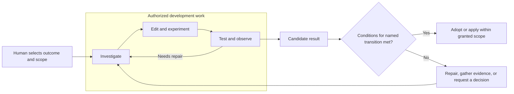
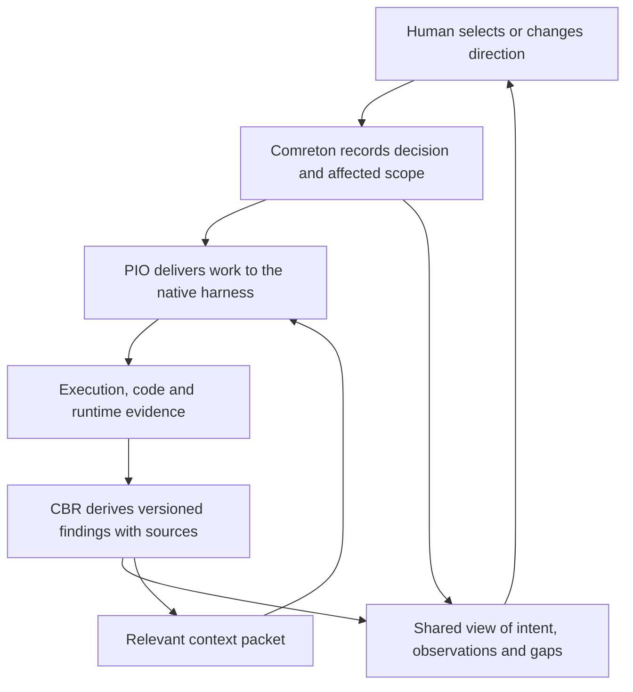

> Public edition `public-development-v1-20260913`. Adapted from the reviewed architecture baseline; names in the source may still say Comreton. See [publication and authority](PUBLICATION.md). Development sequencing is governed by [DEVELOPMENT](../DEVELOPMENT.md); self-development is deferred until all four usable v0.1 releases.

# Human steering with room to experiment

> Accepted behavior in [architecture-v1-20260912](BASELINE.md). Routine investigation/repair continues within scope; intervene for direction, authority or reserved judgment. Default grants, review thresholds and detection accuracy require evaluation; actual adapter support must be demonstrated.

## 1. The behavior we agreed

**Give harnesses freedom to investigate and iterate within an agreed scope. Keep their work understandable as it develops. Block specific consequential transitions when their conditions are unmet.**

The product must solve both execution control and loss of human understanding. Correctly blocking deployment is insufficient if the owner can no longer explain the system. Equally, a useful diagram cannot enforce permissions. Comreton must connect understandable work, meaningful steering and real effect boundaries without turning ordinary development into an approval queue.

Routine work still obeys its resource, access and effect limits. This agreement is not unlimited execution, a guarantee of successful experiments, or a substitute for implementation validation. It refines the existing ownership boundaries: Comreton owns direction and project authority, PIO owns execution, and CBR owns evidence and derived context.

## 2. Three distinct mechanisms

| Mechanism | Purpose | Example | Does it interrupt? |
|---|---|---|---|
| Visibility | Keep the human oriented | The first approach failed; the harness is testing another | Normally no |
| Steering | Resolve a choice outside delegated discretion | Keep compatibility at higher cost, or change the API? | Hold only work that requires the unresolved choice |
| Enforcement | Prevent a transition outside its authorization or proof conditions | Apply this migration to the named production database | Deny that action until its conditions are met |

An alert is not a gate. Acknowledging an alert is not accepting an outcome. A decision is not automatically a new permission grant. A failed experiment is not automatically a reason to stop a harness. A human approval cannot rewrite a failed observation into a pass.

A graph edge can express an ordinary artifact dependency without requiring a human click. A selected check can automatically permit a handoff under policy. Gates and reserved judgments must be explicit about which transition they govern, why and under whose authority.

## 3. Freedom inside the work

Suppose the user says: “Move document processing to worker v2, preserve the existing API, and implement and test locally. Do not change production.”

Within the actual grant, the harness can search, inspect flows, edit code, create disposable fixtures, run tests, compare approaches and repair failures. It need not ask for a new workflow revision for every native tool call or local experiment. The workflow represents meaningful harness assignments and handoffs; the harness retains its own investigation/edit/test loop.



This diagram describes behavior; its boxes do not prescribe fake harness nodes. Native iteration stays inside a real harness node. If a separate repair harness or changed graph is needed, the controller uses the existing authorized scheduling and successor-revision operations. An explicit selected methodology can constrain order; it must leave a valid investigation/repair route rather than requiring a result to pass before the work that can make it pass may run.

Exploring an alternative architecture is different from adopting it as project direction. A scoped prototype may explore an alternative without replacing the selected plan. Findings remain labeled as experimental. Adoption follows the authority the human has delegated; a needed direction change returns to the human when outside that delegation. Prior authorization is reused while its scope and basis remain valid.

## 4. A gate governs a specific transition

The transition contract must explain:

- The target action or reliance decision, its subject and environment.
- Its required evidence or reserved judgment, and the authority establishing those requirements.
- Which work depends on it and which investigation/repair remains authorized.
- Its current validation basis, unresolved conditions and actual enforcement capability.

These are required meanings, not a frozen public field list. [Verification](VERIFICATION.md), [the domain model](MODEL.md) and [the protocol](https://github.com/Combraton/protocol/blob/main/docs/spec/SPEC.md) carry the corresponding responsibilities.

| Migration situation | Expected behavior |
|---|---|
| Local migration fails against disposable data | Continue authorized diagnosis and repair; retain the failed evidence |
| Two implementations need comparison | Allow experiments within scope and budget; retain separate findings |
| Preview reaches worker v1 instead of selected v2 | Keep the mismatch visible; repair automatically when within scope |
| Repair would change the public API | Request the direction decision before adopting or relying on that change |
| Required production evidence is missing | Deny the production action; continue permitted preparation and repair |
| The human is away | Continue independent authorized work; retain the dependent decision wait |
| Execution budget is exhausted or effect outcome is ambiguous | Apply the relevant limit/recovery rule; human absence does not expand authority |

Comreton evaluates project authorization and the selected transition conditions. PIO and the actual tool/provider/environment enforce effect permissions. Broad iteration can run in a development workspace with disposable services; production access can be a separately authorized provider action. A local command is not automatically harmless merely because it runs in a worktree: credentials, network access and external effects determine its actual scope.

Do not give a coding process unrestricted production access and claim a canvas badge can prevent its use. Where enforcement is only cooperative or a capability is unavailable, show that limitation. Enforced restrictions do not depend on CBR identifying an impending mistake in time.

## 5. The shared steering view

The human and harness need a persistent, pointable account of the work. The shared view composes existing project revisions, workflow bindings, decisions, CBR artifacts and observed evidence. It is not another independently writable truth store or another containment level.

| Question | View content |
|---|---|
| What outcome do we want? | Selected intent and constraints |
| Which approach did we select, and why? | Architecture/design decision and rationale, with alternatives retained |
| What should happen? | Expected runtime or data path, where relevant to the task |
| What happened? | Evidence anchored to code/build, environment, attempt and observation coverage |
| Where does reality diverge? | Supported mismatch or a clearly bounded unresolved gap |
| What judgment is pending? | Concrete choice, options, consequences and affected work |

For a tiny bug, this may be a reproducer, a short code-flow finding, a patch and a focused check. For a migration it may include several diagrams and decisions. Absent or not-requested artifacts are valid; the view cannot manufacture a selected architecture or impose universal template stages.

An illustrative snapshot:

```text
Outcome: new uploads use worker v2; preserve API behavior.
Expected: Upload -> API -> queue -> worker v2 -> artifact.
Observed: Upload -> API -> queue -> worker v1 -> artifact.
Basis: preview build B17, request trace 91, selected decision D6.
Meaning: output success does not establish the intended route.
Current work: Codex is checking the routing configuration.
Human decision: none; scoped routing repair is already authorized.
```

If queue evidence is missing, say “divergence is somewhere between API dispatch and worker execution; available evidence does not locate it.” Do not draw an exact causal explanation from a model guess. Intended and observed paths remain different objects; both are distinct from the harness workflow graph.

## 6. Keep the view and work connected



Comreton records selected direction, authority, dependency and decision state. PIO records observed execution and delivery facts. CBR consolidates small discoveries and larger explanations with provenance, applicability and missing coverage. Deterministic projections expose recorded facts; model-assisted explanations remain labeled interpretations.

CBR may report a suspected architecture conflict and suggest a probe. Its model does not gain authority to stop a project, weaken a check, select a new direction or resolve a judgment. Comreton evaluates whether recorded evidence affects a selected condition. Semantic detection is fallible and can lag execution; unknown coverage remains visible.

Context is refreshed for relevant work rather than broadcasting every summary to every active agent. A packet being stored, delivered, or acknowledged does not prove comprehension or compliance. The next evidence can show whether the work actually reflects the selected direction.

## 7. Steering changes the work

Useful actions include: preserve an interface; narrow the outcome; compare alternatives; request a visible slice; challenge an assumption; change the selected approach; or branch from before a decision. The user is not restricted to accepting or rejecting an agent's recommendation.

For “keep compatibility even if it takes longer,” the candidate flow is:

1. Comreton records the decision against the selected revision and identifies affected work.
2. CBR refreshes relevant artifacts/context while preserving the earlier decision and evidence.
3. PIO delivers a supported steering request or reports that the active harness cannot accept it in that state.
4. The UI distinguishes decision recorded, message delivered, and subsequent behavior observed. It never equates them with instant synchronization.
5. Dependent work waits if it cannot proceed under the new decision. Independent work continues. A changed graph uses successor revisions; a context/message update does not secretly replace the active graph.

If an authority change removes a permitted effect, revoke future mediated operations and interrupt affected execution where necessary and supported. A message alone cannot revoke access. Reconcile already-sent effects and disclose any remaining gap; changing intent does not undo production state.

## 8. Attention at every zoom level

At project altitude show outcome changes, consequential uncertainty and pending choices. At session altitude show the purpose, approach and meaningful discoveries. At workflow altitude show harnesses, handoffs and the exact transitions that cannot proceed. At node detail expose native execution, delivered context and source evidence. The same selection survives zoom and lens changes.

Returning after an absence should answer: what changed since the last visit, why it matters, and what happens next. Group one cause affecting many nodes into one item. Routine failures being repaired remain inspectable without flooding the attention queue. Missing observations cannot be narrated as progress.

Consequential decisions show alternatives, evidence, limitations and affected scope. They do not use a preselected approval or polished summary as proof of informed judgment. The design does not infer comprehension from a click, or psychological fatigue from response speed. More intrusive behavioral monitoring is not selected by this agreement.

## 9. Status and validation

**Confirmed:** automatic routine investigation/repair within scope; understandable ongoing work; intervention for a needed direction/authority change or reserved judgment; specific consequential transition boundaries.

**Accepted mechanisms:** the three-way separation above, a composed steering view, scoped waiting, evidence-linked decisions and delivery/behavior distinctions.

**Implementation and task selections:** default grants, per-task reserved judgments, review cadence, demonstrated adapter coverage, divergence detection and detailed presentation. Resolve them at [BASELINE](BASELINE.md) milestones or through explicit task policy; do not invent defaults attributed to the owner.

Compare native harness use, this bounded-autonomy design and a permission-heavy variant on equivalent tasks. Measure accepted result quality, human reconstruction/steering time, unnecessary interruptions, decision-related waiting, and ability to explain the selected approach and locate a failure after returning. Include multi-session work and changes to earlier requirements. Approval rate, confidence and a pleasing summary are not correctness measures. See [PLAN](PLAN.md).

The research informs the proposal but does not validate Comreton: [AI Agents Push Humans Out of the Loop](https://arxiv.org/html/2608.23642v3) is a position paper advocating cognitive support and bounded autonomy. [The user-feedback study](https://arxiv.org/html/2607.17548v1) found perception effects in classification experiments; mandatory feedback, simulated updates and task differences limit transfer to coding. [HumanLayer's essay](https://github.com/humanlayer/advanced-context-engineering-for-coding-agents/blob/main/wsff.md) supports earlier alignment and reviewable slices while explicitly varying process by task size. None establishes our performance or mandates universal review stages.

## Context readiness is another scoped condition

A caller can require bounded context before an attempt starts or before a named transition; advisory enrichment can arrive later. This does not require all memory maintenance to finish. Required context is distinct from proof that its claims are true or understood. The shared view shows the missing item, governed boundary, preparation progress and independent work that can continue. [CBR preparation and delivery](https://github.com/Combraton/cbr/blob/main/docs/spec/PREPARATION-AND-DELIVERY.md) specifies deadlines, fast corrections and late-update behavior.
