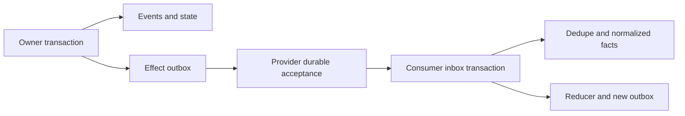

> Public edition `public-development-v1-20260913`. Adapted from the reviewed architecture baseline; names in the source may still say Comreton. See [publication and authority](PUBLICATION.md). Development sequencing is governed by [DEVELOPMENT](../DEVELOPMENT.md); self-development is deferred until all four usable v0.1 releases.

# Storage, recovery, and retention

> Current specification in [architecture-v1-20260912](BASELINE.md). Conceptual contracts are implemented and verified through [PLAN](PLAN.md).

## 1. Separate ownership, shared contracts

Each service owns its journal, object metadata, deduplication records, cursors, and outbox. Comreton records coordination decisions; PIO records execution; CBR records evidence/knowledge. No product writes another product's tables. The new projects may share storage utilities but do not share a mutable database.

Recommended initial storage is one SQLite database per local product installation, with logical project streams and independent owner revisions. This supports local transactions and avoids a broker. It also requires careful export, privacy deletion, and backup; one file is not one project. Physical per-project sharding can be introduced behind the same contracts if measured scale or isolation needs justify it.

```text
<platform-data>/comreton/
  authority.sqlite       operations, views, grants, outbox, inbox, cursors
  objects/               immutable manifests and owned payloads
  projections/           rebuildable read views
<platform-data>/pio/
  execution.sqlite       attempts, hosts, deliveries, leases, usage
  output/                bounded durable log chunks
  checkpoints/           scoped code snapshots or retained references
<platform-data>/cbr/
  evidence.sqlite        claims, provenance, decisions, derivation jobs
  objects/               content-addressed evidence and packets
  indexes/               rebuildable search and dependency accelerators
<repository>/.comreton/   optional explicit export policy only
  truth.lock             portable snapshot manifest
  records/               rendered session/project records
```

## 2. Durable commit

Use transactions, foreign-key constraints, bounded writes, WAL configuration, and a documented durable acknowledgment setting. SQLite's [atomic-commit documentation](https://www.sqlite.org/atomiccommit.html) supplies the local transaction foundation; it does not create a transaction across services or make a subprocess effect atomic.

Semantic journals are application records, distinct from SQLite's WAL files. Derived indexes and cached statuses carry their source watermark. Rebuilding them produces the same semantic state from retained canonical events and objects.

CBR's canonical records include typed memory patches, actual model transformation inputs/outputs, authority inputs and committed revisions. Build manifests identify source frontiers and compiler/index versions; Markdown pages and search structures remain derived. Re-running an LLM is a new derivation, not replay. PIO's canonical records include claim generations, invocation identities, reservations/liabilities and immutable completion receipts. Persist execution intent even when no budget cap is configured. [CBR internals](https://github.com/Combraton/cbr/blob/main/docs/spec/INTERNALS.md) and [PIO internals](https://github.com/Combraton/pio/blob/main/docs/spec/INTERNALS.md) define these logical modules.

For large objects: write to a private temporary location, verify digest/size, flush durable bytes, atomically publish the object, and only then commit a descriptor that claims durable availability. A crash may leave unreferenced objects, which are collectable; it must not create a successful receipt for missing bytes. Filesystem/database ordering and backup must be fault-tested.

## 3. Outbox and inbox



An outbox stores the exact immutable command payload, digest, target, authorization reference, retry class, and reconciliation status. A consumer inbox commits an imported event and cursor together. Delivery can repeat; domain effect identity cannot silently change.

PIO commits a result receipt and its publication outbox together after sealing required payloads. Receipt durability, delivery proof, process/effect reconciliation and project adoption remain independent facts. Recovery republishes committed old-attempt facts under their original identity; it cannot use them to complete a successor. A missing acknowledgment alone must not suppress a result that is otherwise observed.

Snapshots accelerate replay. They name the journal position, reducer/schema version, object dependencies, and checksum. If invalid, rebuild from a compatible checkpoint and events. Schema migration preserves old event meaning through versioned decoding; destructive history rewrites are not routine migrations.

CBR memory jobs persist their selected view, goal, required constraints, inspected source ranges, supported findings, unresolved dependencies, pending work and resource accounting. Tool/model outcomes and exact artifact prose live in retained canonical records/objects; a compact checkpoint points to them. SDK session files or in-memory messages are execution aids, never a competing knowledge authority. A resumed job revalidates its scope and target revisions before committing. Direct provider calls have recorded intent and bounded retry/accounting policy; resuming a job cannot duplicate a previously committed patch.

## 4. Adoption across owners

CBR prepares a manifest and durable holds on required evidence. Comreton validates and adopts it in a local transaction. A pending hold cannot expire merely because an acknowledgment was lost. After adoption, the temporary hold transfers to a durable dependency rooted in the adopting view/branch; only then may the temporary hold be released. An aborted adoption can release its hold after explicit abort or reconciliation establishes no live dependent obligation. Observing adoption never makes the adopted evidence collectable by itself.

Cross-owner references include owner identity and digest. For offline export or trust-boundary transfer, copy authorized bytes and record origin/digest. A consumer must retain the normalized facts needed to replay its own decisions even when rich payloads remain with another owner.

## 5. Crash matrix

| Crash boundary | Durable fact | Recovery action |
|---|---|---|
| Before command commit | No accepted command | Caller can retry same ID |
| After commit, before dispatch | Pending outbox | Dispatch or reconcile same effect ID |
| After provider accepted, before caller received ack | Provider dedupe/result | Query same ID; no new logical effect |
| After harness prompt write, before delivery recorded | Submission intent only | Delivery ambiguous; inspect host/native result |
| During artifact upload | Unsealed staging object | Resume/retry upload; never cite as sealed evidence |
| After seal, before adoption | Sealed object and pending hold | Reconcile adoption; no partial project truth |
| After adoption, before provider sees decision | Controller decision exists | Replay decision; preserve hold meanwhile |
| During branch creation | Atomic branch/head operation | Either committed branch or no branch |
| During collection | Mark/grace metadata | Recheck roots before delete; record unavailable/tombstoned status |
| After invocation dispatch right, before outcome is known | Dispatch intent and unresolved liability | Probe/reconcile; no timeout refund or automatic opaque replay |
| After completion commit, before remote publication | Immutable result receipt and outbox | Publish original receipt; do not launch again |
| While CBR projections lag | Canonical source frontier and older index watermark | Bounded fallback or explicit incomplete coverage; no false absence |

Recovery prioritizes dangerous unknown effects and contested execution ownership. Unrelated projects and paths can continue once their own basis is valid. We do not globally freeze all work because one low-risk metadata source is unavailable.

## 6. Timers, disconnection, and storage pressure

Persist timer identity, deadline, scope, and reason. A timer service emits a recorded `TimerFired` input even if the system otherwise has no activity. A late timer does not imply the process died. It starts the configured probe, deadline handling, or reconciliation.

On disk pressure, shed derived caches first, then eligible telemetry under policy. Do not collect unique evidence cited by retained branches to keep an animation running. If canonical writes cannot be committed, stop new authority/effect admission and show a storage failure. In-flight hosts follow their last known safe policy and retain explicit uncertainty if reporting fails.

## 7. Retention is reachability plus policy

Roots include all retained branches, selected project views, human pins, nonterminal attempts, active packets, open gates, uncompleted exports, and unresolved effect obligations.

Active CBR memory jobs/checkpoints also hold the evidence and artifacts required for continuation; terminal jobs remain subject to retained history and explicit retention policy. A small checkpoint is insufficient for reproducibility if its required source objects have been removed. Trace their dependency closure. Leases coordinate holds across owners; reference counting can optimize bookkeeping but cannot alone decide collection because cycles and remote uncertainty exist.

Collection: mark candidates → wait grace interval → recheck roots and holds → delete permitted bytes → append tombstones/availability facts. New references must establish holds before adoption, acting as a write barrier against concurrent collection.

Archive is not prune. Losing or obsolete branches are retained until direction is finalized and the applicable policy explicitly permits pruning. [History](HISTORY.md) defines the user-facing impact preview.

## 8. Export, backup, and privacy

A project export contains immutable semantic records, object manifests, selected payloads, source positions, schema versions, and declared omissions. Imported events receive new local positions while retaining original identities and provenance. A destination cannot treat the source's local sequence number as its own global order.

Backup coordinates each owner's database snapshot and required object set, recording an observation frontier across products. Restore verifies digests, replay compatibility, and unresolved effects before admitting new work. Restoring an old database must not replay a deployment or external send already performed after that backup.

Store incarnation identifies replacement, not rollback to a backup of the same store. Restore holds new effect admission behind reconciliation with surviving hosts, controller generations and external obligations. Stale mediated commands are fenced; already-running external effects still need observation or containment.

`truth.lock` is a portable evidence/claim view. Offline status can check locally available anchors and report remote observations as unavailable or expired. It cannot establish current production behavior without observation. Import is an explicit operation; editing an exported file does not automatically change authority.

Privacy purge is exceptional and reports affected claims, packets, backups/exports under local control, and historical reproducibility. Preserve only metadata allowed by deletion policy; even hashes or names can be sensitive. Previously exported copies outside the system's control cannot be promised erased.

## 9. Required validation

Fault injection must cover every crash row, object-before-descriptor ordering, outbox replay, inbox cursor atomicity, concurrent root creation during collection, restored-backup effect reconciliation, disk-full behavior, corrupted snapshots, migration replay, and project export/import with a changed local sequence space. A green unit test suite without these failure boundaries is insufficient storage evidence.

## Durable preparation, memory views and delivery

CBR stores preparation/job identity, pinned basis, observed reads, source frontiers, subscriptions, outstanding children, consumed budget and gaps outside model context. Coalesced subscribers retain their own request lifecycle. Optional Python/SDK state is replaceable execution state, not canonical memory. Capture loss remains explicit after restore.

Immutable memory views select artifact revisions and multiple producer frontiers. Exact initial packets and versioned updates retain bytes, metadata and observed delivery history under retention policy. Do not rewrite a delivered packet during consolidation. Authoritative corrections remain addressable through the controller/standalone authority while CBR ingestion catches up; the record must distinguish supplied authority input from an observed CBR event. No cross-service atomic snapshot is implied.
