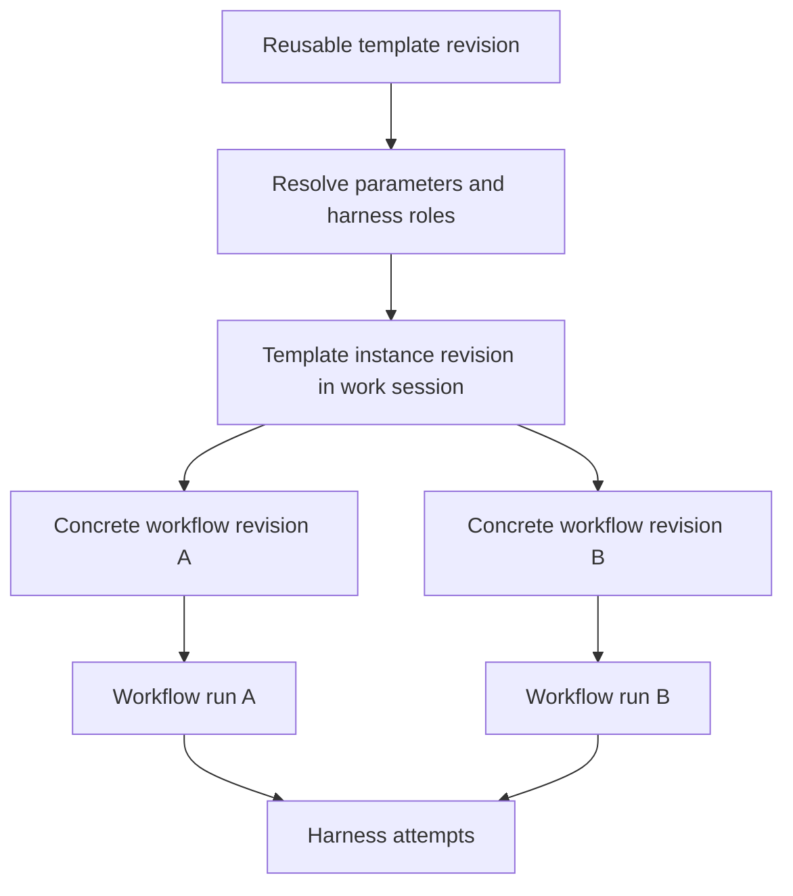
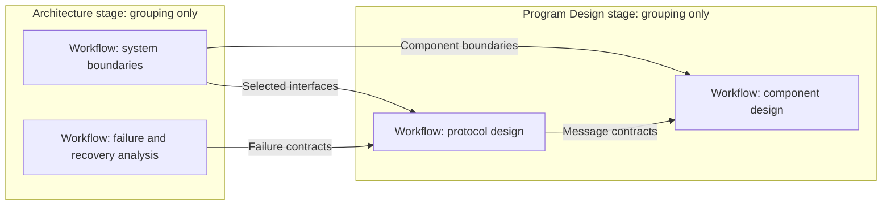

> Public edition `public-development-v1-20260913`. Adapted from the reviewed architecture baseline; names in the source may still say Comreton. See [publication and authority](PUBLICATION.md). Development sequencing is governed by [DEVELOPMENT](../DEVELOPMENT.md); self-development is deferred until all four usable v0.1 releases.

# Templates and actual harness workflows

> Current specification in [architecture-v1-20260912](BASELINE.md). Conceptual contracts are implemented and verified through [PLAN](PLAN.md).

## 1. The distinction

**A template is reusable methodology/configuration. A workflow is an actual harness graph.**

A template may define one stage or many. Each stage may contain one or more workflow blueprints. A blueprint declares harness roles, ports, artifact slots, input parameters, checks, and typed control regions. Instantiating resolves those definitions into concrete workflow revisions within a work session.



Stages organize or constrain those workflows. They do not execute and do not create another canvas altitude.

## 2. The owner's example, without making it universal

| Optional template stage | Example actual workflows | Example output bindings |
|---|---|---|
| Product | Claude Code explores the goal; Codex challenges assumptions | Journey, acceptance rubric, non-goals |
| Architecture | Codex proposes alternatives; Claude Code analyzes failures; another workflow checks integration boundaries | Selected architecture, alternatives, failure model, proof plan |
| Program Design | Codex maps types and runtime paths; Claude Code reviews interface contracts | Component contracts, file/function plan, distinguishing tests |
| Visible Vertical Slices | Implementation harness, reviewer harness, verification harness in bounded iterations | Thin working changes with journey and runtime evidence |

Architecture can contain several workflows whose outputs feed one or more Program Design workflows. The selected instance defines those dependencies. The kernel does not hard-code stage names or infer causality from their visual order.



This is a session-level view of workflows. Opening any workflow reveals harness nodes, not stage nodes.

## 3. Conceptual reusable schema

```yaml
template_revision:
  schema: template.v1
  template_id: feature-development
  revision: illustrative-r3
  parameters:
    goal: {type: text, required: true}
    repository: {type: repository_ref, required: true}
  roles:
    designer: {kind: harness, requires: [structured_result]}
    reviewer: {kind: harness, requires: [structured_result]}
  stages:
    - id: architecture
      name: Architecture
      workflows:
        - blueprint_id: boundary-review
          nodes:
            - {id: propose, role: designer}
            - {id: challenge, role: reviewer}
          handoffs:
            - {from: propose.design, to: challenge.design, requires: produced}
          outputs:
            - {slot: selected_design, from: challenge.design}
      checks:
        - {slot: selected_design, property: selected_by_authority}
  bindings: []
```

This sketch omits full type declarations for readability. The final schema must declare all node ports and output contracts; `selected_by_authority` names a typed check, not executable template code. A template can use an existing verifier capability by reference, but importing the reference does not install or authorize it.

## 4. Instantiation is a compilation step with provenance

1. Load an immutable template revision and validate its schema and required capabilities.
2. Resolve parameters, repositories, artifacts, and harness roles against available providers.
3. Expand blueprints into fresh workflow/node identities. Preserve a source map from each concrete object to template stage, blueprint, and revision.
4. Resolve cross-workflow artifact bindings and selected checks. Detect missing ports, type mismatch, impossible dependencies, and loops without limits.
5. Present the actual workflow graphs, requirements, effect scope, and estimated budget for review/customization.
6. Commit the template instance revision and concrete workflow revisions atomically in Comreton.
7. Start runs only under an applicable execution grant. Instantiation alone has no side effects in a repository or harness.

Users may customize before starting: change stage names/order, harness roles, graphs, inputs, outputs, and checks. Save the customization as a new template revision when it should be reusable. Otherwise keep it in the instance revision with its source mapping.

An update to the catalog never mutates an existing instance. “Apply template update” computes a diff and produces a successor instance/workflow revision. In-progress runs stay pinned to their original graphs.

## 5. Stage order and gating are explicit

Moving a stage in the list changes presentation order unless the user also changes a declared stage constraint. A selected `complete_stage_before_start` constraint compiles into a boundary condition over referenced workflows, not another executable node.

For cross-stage inputs, use concrete slot bindings. If two Architecture workflows produce `interfaces` and `failure_contracts`, Program Design can require both. Another research workflow can run concurrently if it reads neither. Stage completion is derived from its selected required outputs and workflow outcomes; optional workflows do not silently hold the stage forever.

Do not create a global “missing architecture” state. A direct workflow that did not request architecture has `not_requested`; a workflow that requires an architecture artifact but has no binding has `not_recorded` and a specific unmet requirement.

A selected stage constraint governs its named boundary, not every experiment inside the producing workflow. Template checks must distinguish readiness inputs from output acceptance and reserved judgments; a failing output check should leave authorized repair reachable. Users do not need a new stage, graph node or approval for each native harness search/edit/test cycle. Standard templates follow the same [autonomy and steering principle](STEERING.md).

## 6. Executable graph semantics

| Object | Executable meaning | User representation |
|---|---|---|
| Harness node | Run a bounded brief through a named adapter/role | Harness card |
| Data handoff | Bind one immutable output into an input port; declare when it can be consumed | Directed labeled edge |
| Dependency-only edge | Wait for a named outcome without copying an artifact | Distinct dependency edge |
| Reference association | Point at context without creating readiness dependency | Dashed contextual connection |
| Gate | Evaluate conditions for a named transition or wait for its explicitly reserved judgment; preserve authorized repair | Edge/boundary badge |
| Fan-out | Make several eligible branches available | Several outgoing edges |
| Join | Select `all`, `any verified`, or a declared typed reduction over outcomes | Join marker, not a harness |
| Loop region | Repeat with explicit feedback inputs, exit predicate, and limits | Bounded region |
| Retry policy | Create new attempts after specifically classified failures | Node/region policy badge |
| Budget region | Bound cumulative usage for the enclosed occurrences | Region budget badge |

One run identifies every occurrence by run, node, loop path/iteration, and retry number. This prevents evidence from iteration one opening the gate for iteration two without a reuse decision.

Joins combine artifact references or choose among verified outputs. They do not merge code automatically. An integration harness may create and test a merge candidate. `any verified` records the selected winner; losing attempts are cancelled best effort and remain in history. Late results are still inspectable.

Nested regions are permitted when containment and entry/exit rules are unambiguous. Crossing/overlapping loop regions are invalid. At a loop boundary, updated artifacts become the next iteration's explicit bindings. Exhaustion produces the configured pause/failure outcome; it cannot become acceptance because the budget ran out.

## 7. Template lifecycle

| Operation | Result |
|---|---|
| Create from scratch | New catalog identity and first revision |
| Copy standard/user template | New identity with source provenance and editable content |
| Save workflow as blueprint | Strip execution identities and live permissions; retain typed graph/configuration |
| Add/remove/reorder stages | New template revision; validate affected bindings |
| Change graph or check | New revision and semantic diff |
| Import/export | Versioned data bundle with required profile references |
| Instantiate | Concrete instance and workflow revisions in a session |
| Archive/unarchive | Change catalog visibility, preserving referenced revisions |

Export never carries credentials, live process handles, active attempts, approval tokens, or accepted historical outcomes. Example artifacts must be clearly marked samples. A standard template cannot access a private operation unavailable to a user-created equivalent.

## 8. Required counterexamples

The architecture is wrong if any of these cannot work:

- A single Codex workflow investigates a question with no template and no implementation stage.
- A user creates `Investigate → Patch → Test`, with only the artifacts and gates they selected.
- A template has one stage containing three independent research workflows.
- Two Architecture workflows feed one Program Design workflow through separate artifact slots.
- An existing template is copied, its stage names changed, and its graph edited without special privileges.
- The user branches midway through an instance, preserves successful outputs, replaces one workflow, and retains the older branch.
- A project explicitly chooses a methodology policy; another project does not. Only the first enforces that policy.

These are contractual acceptance cases, not optional UI polish.

## Context obligations in blueprints

A blueprint may declare bounded context slots and checks using the same typed input/contract semantics as a direct workflow. Instantiation binds authority, actual source basis and the selected needed-before boundary. Optional preparation adds no mandatory stage, fake memory harness node or executable template script. Standard templates cannot impose hidden global assimilation or review requirements. [CBR delivery](https://github.com/Combraton/cbr/blob/main/docs/spec/PREPARATION-AND-DELIVERY.md) defines the shared meanings.
