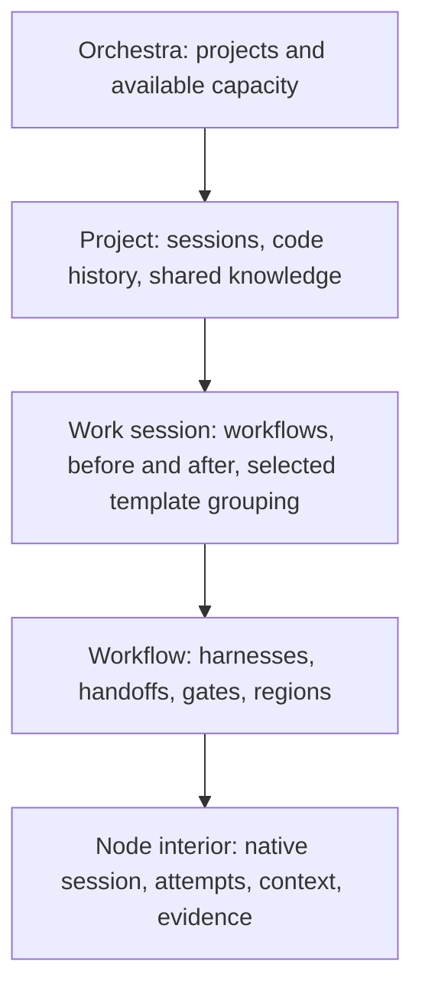

> Public edition `public-development-v1-20260913`. Adapted from the reviewed architecture baseline; names in the source may still say Comreton. See [publication and authority](PUBLICATION.md). Development sequencing is governed by [DEVELOPMENT](../DEVELOPMENT.md); self-development is deferred until all four usable v0.1 releases.

# UI: the human's spatial control plane

> Current specification in [architecture-v1-20260912](BASELINE.md). Conceptual contracts are implemented and verified through [PLAN](PLAN.md).

## 1. The canvas is home

The product is one continuous spatial surface. Work is drawn, inspected, and steered in the same place. Attention is a lens, with an optional sortable list inside the current scope. It does not replace the canvas with a separate dashboard.



Each altitude has a meaningful spatial scene. Zooming changes semantic detail and containment while preserving identity and a recognizable route back. Template stages are bands or grouping labels within a session, never another navigation level.

## 2. What remains visible when work compresses

A compressed workflow/session/project shows purpose, factual execution state, required proof status, unresolved attention, cost coverage, and the latest meaningful change. Compression must not hide a failed gate, ambiguous effect, or stale input.

Keep stable placement during updates. Auto-layout is explicit, previewable, and reversible. A selected object remains selected across lenses and zoom. Breadcrumbs, an outliner, keyboard movement, and a minimap provide routes without relying on precise trackpad gestures. Reduced-motion mode preserves the same semantic transitions.

Use hysteresis around altitude thresholds to prevent accidental bouncing. The exact thresholds and animation duration are usability measurements, not architecture constants borrowed from another product.

## 3. Drawing becomes typed intent

| Interaction | Immediate result | Commit condition |
|---|---|---|
| Place a harness | Draft node with a selected role/adapter | Valid brief and graph revision |
| Connect ports | Preview typed handoff | Matching port types and dependency semantics |
| Enclose nodes as loop | Draft control region | Feedback bindings, exit proof, limits, exhaustion action |
| Add gate badge | Show required property and authority | Valid contract reference |
| Reorder template stage | Preview stage layout/order | Explicitly show any dependency change separately |
| Move/color/annotate | Update presentation | No execution meaning unless explicitly converted |

Invalid semantic edits explain the missing condition inline and preserve the last valid executable revision. They never silently demote an executable loop or gate to decoration. Complex edits show the affected nodes, requirements, budget, and already-running work; routine low-impact edits remain fluid.

## 4. Node and edge state

Show three distinct signals: what execution is doing, what has been verified, and whether the inputs/proof still apply. For example:

```text
Codex · implement upload routing

Execution       Result returned
Verification    Component checks pass; journey not evaluated
Applicability   Environment changed since last trace

Received        Architecture A7 · packet K12 · tree T30
Changed         6 files in isolated workspace
Needs           Run the journey against build B31

Inspect attempt · Open evidence · Branch from input checkpoint
```

An edge can show its exact output binding, gating property, and blocked cause. Data associations and scheduling dependencies are visually distinct. Motion appears only for actual state transitions or backpressure, not decorative token traffic.

## 5. Lenses

| Lens | What it answers | Interaction |
|---|---|---|
| Work | Who is doing what, and what can proceed? | Draw, pause, steer, inspect |
| Attention | What decision or uncertainty needs me? | Select grouped cause and act in place |
| Truth | What is intended, observed, and supported? | Inspect sources; challenge or supersede |
| Time | How did this state arise? | Scrub semantic checkpoints; compare and branch |
| Evidence | What did the actual artifact/runtime show? | Open diff, trace, image, test, or source beside its claim |

The same selected node survives lens changes. A user can go from a blocked edge to its failed property, the trace showing the wrong route, and the earlier architecture decision without losing the spatial context.

## 6. Attention without alert inflation

Group common causes. Ten blocked nodes caused by one missing permission produce one actionable item with affected scope. Each item contains what changed, why it matters, evidence, choices, consequences, and the relevant version. Sort by safety/irreversibility, blocking impact, and age with visible rationale; do not import fixed alarm-industry percentages or auto-escalate everything to urgent.

Acknowledging an alert does not resolve its gate. Snoozing changes notification behavior, not execution truth. A stale recommendation updates or disables itself when its decision basis changes. Routine deterministic work proceeds under policy without human clicks.

### Keep visibility, decisions and enforcement distinct

Routine investigation and repair are inspectable without demanding a click for every failure. Display what is being repaired, why it matters and the next step. A decision item names the direction/authority change or reserved judgment, alternatives, consequences and affected work. A blocked-transition badge identifies the exact action/reliance and missing condition, not a blanket “project blocked” state. Independent authorized work continues while a judgment waits.

The [shared steering view](STEERING.md) composes desired outcome, selected architecture/rationale, expected path, observed evidence, supported divergence and pending decisions. Keep its selection stable across canvas lenses and zoom: project outcomes/choices, session approach/discoveries, workflow handoffs/transitions, then native execution and evidence. It is not a new navigation level or a separately maintained document. For a small bug it can be a compact reproducer/flow/patch/check record. Missing path observations remain explicit.

Offer direct steering actions: narrow the outcome, preserve an interface, request a visible slice, compare alternatives, challenge an assumption or branch from an earlier decision. The return view emphasizes changes since the last visit and what happens next, with source links and coverage. Do not equate a click with understanding, preselect approval as evidence of judgment, or infer fatigue from response speed. Default review cadence remains to be tested.

## 7. Session record and history

The project view positions sessions against real Git history through explicit source spans. A session record presents before, intended change, executed work, after, evidence, costs, and unresolved obligations. Optional template artifacts appear only when selected or present. Another template can show completely different artifacts.

Review actions are semantic: accept named outcome, accept selected properties, reject with reason, request new proof, or branch and restart. They do not masquerade as Git merge buttons.

The history preview separates “what we knew then” from “what later evidence says about then.” It shows code snapshot coverage, native context coverage, evidence availability, and unresolved effects. “Restart here” leads to the [RestartPlan](HISTORY.md); it never performs a hidden reset.

## 8. Native session and harness control

Inside a node, show the native session where supported, alongside the bounded brief, context packet, permissions, and attempts. Native attach has an explicit controller/read-only mode. A user steering through Codex/MCP and a user manipulating the canvas operate on the same semantic revision.

Show decision recorded, native steering delivery and subsequent behavior as different states; delivered context does not establish compliance. Live steering and revocation limitations remain visible.

When a harness requests approval, show the actual requested action and scope. The UI distinguishes policy approval from native permission acknowledgment. If the adapter cannot surface a request reliably, unattended execution is visibly limited.

## 9. Explanation without invented facts

Hover uses the deterministic Pulse and never triggers a model call. “Explain how we got here” opens the latest version-stamped Steward brief or requests a new one. The brief separates recorded facts, interpretation, recommendation, and unknowns, with citations. Render it from structured data into canvas, Markdown, or a safe share view.

Session/project records can export to local Markdown and later external document applications through explicit destination policy. Export failure does not lose the canonical record. Redacted exports disclose missing evidence.

## 10. Renderer architecture and design acceptance

The semantic scene and operation model sit above a renderer adapter. Evaluate an infinite-canvas foundation and a node-editor foundation against the same interaction fixtures. [Excalidraw's API](https://docs.excalidraw.com/docs/@excalidraw/excalidraw/api) and [React Flow's performance guidance](https://reactflow.dev/learn/advanced-use/performance) demonstrate useful surfaces, not proof that either meets this whole UX.

The first interaction prototype, after architecture agreement and before committing to a production renderer, must show: continuous altitude changes, editable harness graphs, arbitrary annotations, typed loops/gates, stable layout under live updates, attention in place, native-session inspection, branch comparison, keyboard equivalence, and usable large-scene performance. No product library is selected solely because it renders attractive nodes.

## Context preparation in the shared work view

Show preparation as evidence/context state on the existing work surface, not a new canvas level or fake harness node. Distinguish advisory enrichment, a bounded initial-context wait and a condition for a later transition. The user can inspect the required item, source basis, gaps, preparation cost and work that continues independently.

A project can show partial orientation with useful task artifacts while broader assimilation remains incomplete. Do not label it “understood” from repository age or a model confidence score. Packet inspection shows exact initial content and later deltas, actual delivery timing and missing observations. Late context is useful history or repair input, not evidence that an earlier mistake was prevented. This view uses [the delivery contract](https://github.com/Combraton/cbr/blob/main/docs/spec/PREPARATION-AND-DELIVERY.md) and existing steering/history operations.

## Independent PIO terminal interface

This chapter specifies Combraton's spatial desktop. PIO separately owns a [CLI/TUI client](https://github.com/Combraton/pio/blob/main/docs/spec/STANDALONE-CLIENT.md) for supported-harness discovery, execution management and optional CBR context. It needs no canvas, template stages or Combraton project model. The desktop uses public PIO/CBR APIs directly; it does not embed the terminal UI. Neither presentation owns execution or memory truth.
