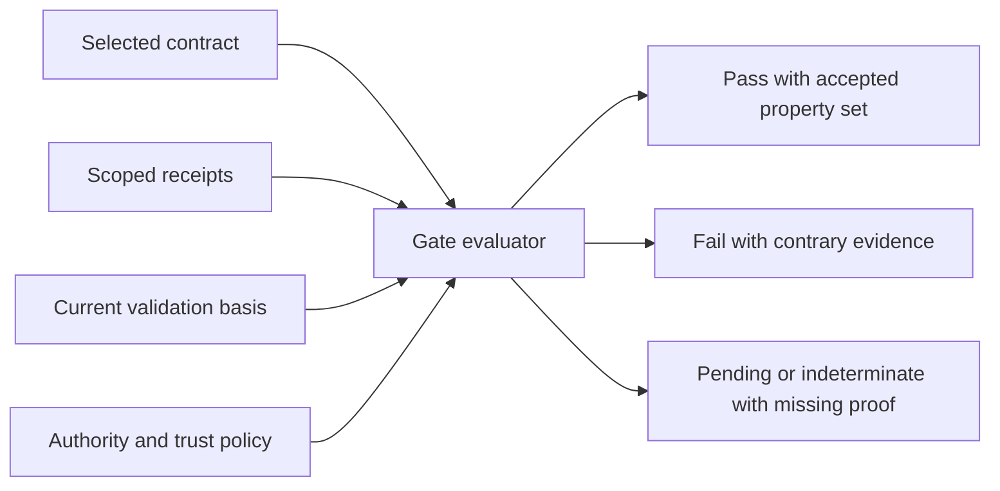

> Public edition `public-development-v1-20260913`. Adapted from the reviewed architecture baseline; names in the source may still say Comreton. See [publication and authority](PUBLICATION.md). Development sequencing is governed by [DEVELOPMENT](../DEVELOPMENT.md); self-development is deferred until all four usable v0.1 releases.

# Verification: prove the selected outcome

> Current specification in [architecture-v1-20260912](BASELINE.md). Conceptual contracts are implemented and verified through [PLAN](PLAN.md).

## 1. Define proof before the work

A verification contract states the outcome, subject, required properties, acceptable evidence, evaluator authority, environment, and freshness requirements. It is attached to a workflow/node or handoff before execution. Changing the contract creates a new revision; old failures remain visible.

Different work needs different proof. Research may require cited findings and review. A local parser change may need a focused regression fixture. A visible product feature may require a real journey, the intended runtime path, and qualitative judgment. There is no universal six-step ceremony for every task.

### Proof conditions must not suppress the work that produces proof

Attach each condition to the transition it governs: for example, adopting an outcome, handing an accepted artifact downstream, or applying a migration to a named environment. Do not apply output acceptance conditions indiscriminately as preconditions for investigation or repair. A local failing test is normally useful feedback inside the native harness loop.

Routine scoped diagnosis, experimentation and repair continue without a new human click. Ask for intervention when the needed solution changes direction, expands authority or reaches a reserved judgment. If separate repair execution is needed, schedule it through existing authorized graph/attempt semantics; never silently mutate the active graph. A production action may remain blocked while local preparation continues. See [STEERING](STEERING.md).

## 2. The evidence ladder names different questions

| Layer | Question | Example |
|---|---|---|
| Static/build | Does the code parse, typecheck, and build? | Compiler output at tree T |
| Component | Does this unit satisfy a local property? | Parser handles a named malformed input |
| Integration | Do the relevant components interact correctly? | API and worker pass data using the new schema |
| Journey | Does the selected user action complete? | Upload a document and generate the expected artifact |
| Runtime path | Which build, configuration, and route actually served that journey? | Correlated browser request, API, queue, worker evidence |
| Qualitative/domain | Does the result meet the intended quality? | Human evaluates layout or a domain-specific rubric |

Lower-level evidence cannot substitute for a required higher-level property. Equally, a screenshot does not prove data integrity or authorization correctness. The contract names the property and suitable observation method.

## 3. Receipt and gate evaluation

```text
VerificationReceipt
  subject digests and target anchors
  contract digest and evaluator identity/version
  observed build / environment / inputs
  property results: pass | fail | not_evaluated | indeterminate
  evidence references and capture coverage
  start/end observation times and validity constraints
  execution/provenance references; signature where required
```



The evaluator checks subject identity, contract revision, evaluator authority, required evidence availability, anchor applicability, and positive coverage of every required property. `not_evaluated` never counts as pass. An unavailable browser is an indeterminate journey check, not proof that the product is broken. It holds only transitions requiring that observation. A suspected mismatch from CBR alone cannot manufacture a reserved judgment or stop unrelated work.

A partial acceptance names the accepted properties and remaining obligations. It cannot open a downstream edge requiring the entire contract. Human override is an explicit policy exception with reason and scope; it does not rewrite a failing receipt into a passing one.

## 4. Runtime proof must distinguish the wrong path

Suppose both v1 and v2 return HTTP 200. A check that only observes 200 cannot prove v2 served the request. The proof plan must identify a distinguishing observation: build identity, route selection, feature flag, worker marker, or correlated side effect unique to the intended path.

Use trace parent/child relationships or span links according to actual causality. [OpenTelemetry](https://opentelemetry.io/docs/concepts/signals/traces/#span-links) supports links for associated operations, including asynchronous traces. Neither a link nor a span name proves that instrumentation is complete or truthful. The collector/verifier must bind the observation to the test run, deployment/build, and expected environment.

For important path-selection changes, use a negative control: deliberately force the old route in an isolated environment and require the new-path check to fail for the expected reason. Distinguish a meaningful failure from a crashed test runner. This validates the check's sensitivity to that particular mistake, not universal correctness.

## 5. Integration is a new subject

Parallel harnesses may produce individually passing patches that conflict after integration. The integration candidate has a new tree/build identity. Required checks rerun against that candidate unless their contracts explicitly establish transferable applicability.

Code review, merge, deploy, and product acceptance are different operations. Accepting a design does not merge code. Merging code does not demonstrate deployment. Successful deployment does not establish the product journey works.

## 6. Independence and qualitative judgment

A second model reviewing the same unsupported summary is not independent corroboration. Record shared sources and evaluator lineage. A critical property may require another tool, observation, or human with relevant authority.

Qualitative evaluation names the rubric, artifact/sample set, viewing conditions where relevant, reviewer, and rationale. “Looks good” on a thumbnail cannot silently become approval of every page or state. The UI lets the reviewer inspect the actual artifact and correct the scope.

## 7. Provider failure and evidence loss

Verification providers run under declared effect permissions and budgets. A debugger expression may mutate application state; a browser journey may create real data. Do not label these read-only just because their purpose is testing.

Missing, redacted, or pruned evidence changes present proof availability. Historical acceptance remains an event, while current reliance may become indeterminate. A new required observation must be gathered rather than filled in from a summary.

## Context obligations are not comprehension proof

A selected transition may require a bounded context item. Verify its identity, selected authority, applicability, inclusion and required delivery evidence separately from the factual proposition it contains. Missing context at deadline is unmet; receipt is not understanding. Required initial context must not create a resource cycle with its preparation job.

Add fixtures for late correction during consolidation, stale/dirty/multi-repository basis, shared-lineage false corroboration, oversized aggregate output, repeated model resets, missing runtime evidence and late delivery. Compare retrieval, request-time, background and optional programmatic variants at equal task/effect scope and count cold-start costs. See [CBR delivery](https://github.com/Combraton/cbr/blob/main/docs/spec/PREPARATION-AND-DELIVERY.md) and [PLAN](PLAN.md).
