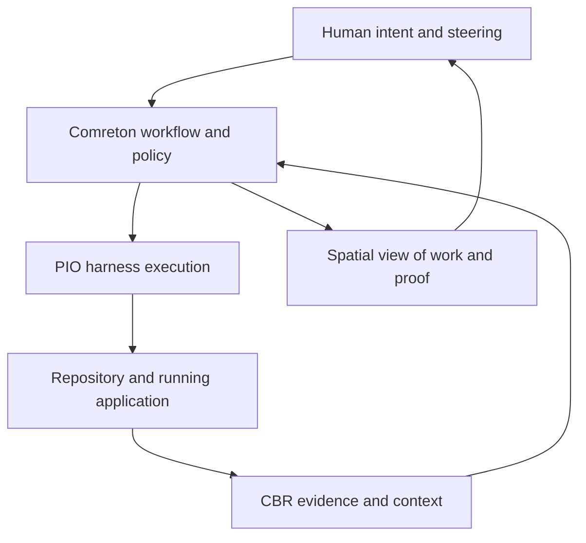

> Public edition `public-development-v1-20260913`. Adapted from the reviewed architecture baseline; names in the source may still say Comreton. See [publication and authority](PUBLICATION.md). Development sequencing is governed by [DEVELOPMENT](../DEVELOPMENT.md); self-development is deferred until all four usable v0.1 releases.

# The product we are designing

> Owner constraints and architecture baseline finalized; component selections and product-benefit validation follow [BASELINE](BASELINE.md).

## The problem starts after the first few successful sessions

An agent can write a substantial change while the human, documentation, repository, and running application drift apart. The next agent reconstructs a different project. A later agent treats an abandoned plan as current. Tests pass while the frontend still invokes the old backend path. The owner spends more time reconstructing the project than steering it.

Comreton gives the human and harnesses a shared, persistent object to work on: the project's intent, selected plans, actual execution, code changes, evidence, and unresolved differences. Each assertion can be inspected at its source. Each consequential change can be compared with what came before.

## The experience

You open a project on a continuous canvas. Its work sessions show what they attempted, where they sit in the code history, what they changed, and where your attention matters. Zoom into a session and see its workflows. Zoom into a workflow and see actual harnesses, their handoffs, and their execution. Open a node to inspect what it received, what it did, and what its output actually proves.

You can draw a workflow yourself or ask a harness to propose one. You can start from a reusable template, change its stages and graphs, or use no template. Drawing a handoff or bounded loop changes orchestration semantics. Arrangement, color, and freehand notes remain presentation unless you deliberately convert them into semantic operations.

When work goes wrong, you inspect the point where the plan, evidence, or implementation diverged. You branch from that point, select what to preserve, and restart. Earlier branches remain available while you experiment. The system tells you which code and context can be restored and which external effects cannot.

Long-running work continues when the desktop closes. Returning tomorrow reveals a factual account of progress, decisions, uncertainty, and cost. You do not need to read a terminal transcript to discover that a harness has been waiting for permission for six hours.

## The four independent pieces

| Piece | Plain-language job | Independent usefulness |
|---|---|---|
| Comreton | Decide what work may proceed and make the whole project steerable | A control plane with replaceable execution, evidence, and tool providers |
| PIO | Run and supervise existing harnesses faithfully | A CLI/TUI/service for durable harness execution, workspaces, delivery, and recovery |
| CBR | Preserve what was observed, distinguish it from interpretation, and assemble useful context | A local evidence and context service for harnesses, CI, or other applications |
| Protocol | Let these systems exchange typed work, observations, evidence, and decisions | An independently adoptable contract with small optional profiles |

PIO and CBR will be new projects under the Comreton organization. Existing projects supply lessons and possible reference code; their schemas, storage, and runners do not constrain the fresh design. Reuse requires separate technical and license assessment later.

## What must remain true

1. **Comreton is the main controller.** PIO cannot select product direction; CBR cannot silently accept a new architecture; a plugin cannot become a second project scheduler.
2. **Executable workflow nodes are existing harnesses.** Gates, loops, joins, templates, tools, and artifacts have explicit semantics without pretending to be agents.
3. **Templates are optional methodology.** Standard and user-created templates share the same schema and operations. There are no universal Product or Architecture stages.
4. **The canvas remains home.** Attention, truth, time, and evidence are views of the same project space. Accessible lists and keyboard operations expose equivalent meaning.
5. **History preserves alternatives.** A correction creates a new operation or revision. Restart creates new execution. Ordinary pruning waits for a settled direction and explicit policy.
6. **Every conclusion has a scope.** A passing local test is evidence about that test. A runtime trace describes the observed build, environment, and request. A human decision expresses intent or acceptance; it cannot rewrite an observation.
7. **The human can steer without babysitting.** Routine investigation and repair continue automatically within agreed scope. Keep work understandable as it develops; request intervention for a needed change in direction, authority, or an explicitly reserved judgment. Block specific consequential transitions whose conditions are unmet, while other authorized work can continue. [STEERING](STEERING.md) records this owner-confirmed principle and the accepted mechanisms.
8. **Persistent does not mean one immortal conversation.** Native sessions can end. Durable project state and fresh context keep work coherent across harness changes.

## One important distinction: intended versus observed

Suppose you choose worker v2 as the architecture. A browser trace then shows that request 91 used worker v1. Both records can be correct: one records what you intend, the other what happened. Comreton shows a gap requiring action. It does not merge them into one conflicted fact or let the newer one overwrite the older one.

Similarly, “the code exists,” “the build includes it,” “the application selected it,” and “the result meets the requirement” are different claims. This distinction is the practical center of the product.

## What makes the combination worth building

The candidate contribution is the connection between human-drawn work, explicit reliance on evidence, durable execution, and reversible project history. This is a product and architecture hypothesis, not a claim that any ingredient is unprecedented.

Three experiments matter particularly:

- Can a fresh harness act correctly with a smaller, cited, task-specific context packet?
- Can the human identify and correct the wrong assumption faster than with native sessions and Git alone?
- Can the system recover from interrupted or misleading work without duplicating effects or losing useful alternatives?

The [evaluation plan](PLAN.md) compares the full system with strong native-harness baselines and smaller combinations. If context or review overhead outweighs the benefit, we reduce that mechanism. We do not redefine “better” as more orchestration activity.
